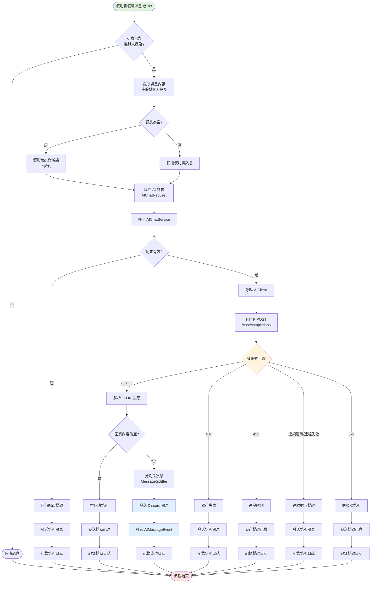
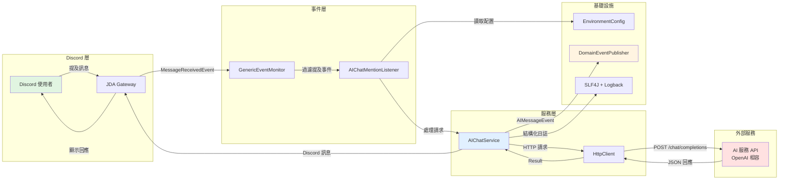
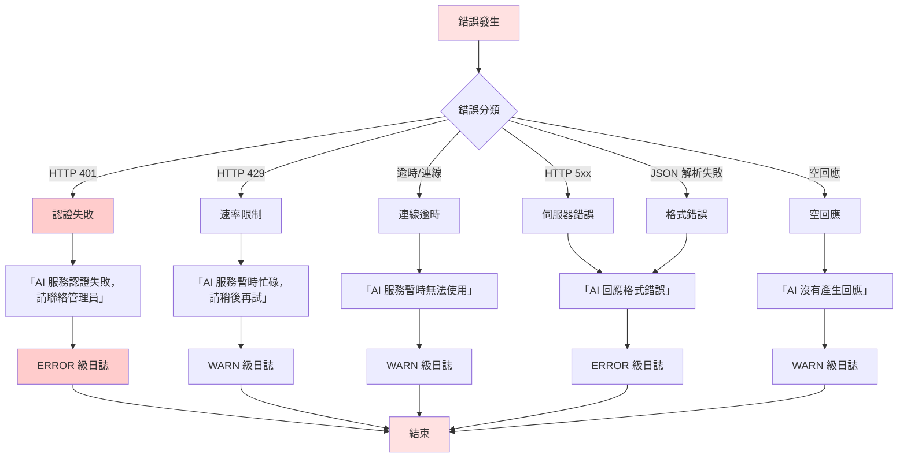
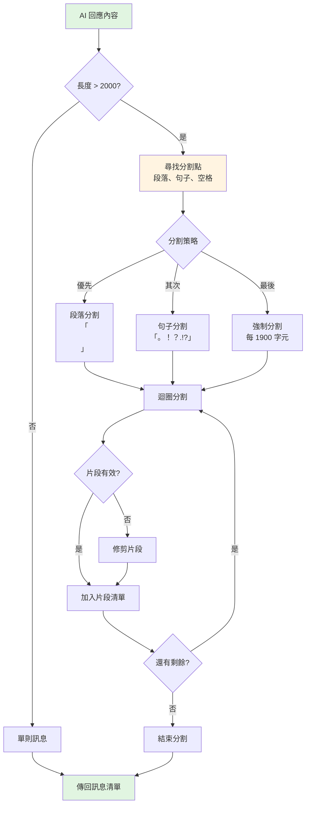
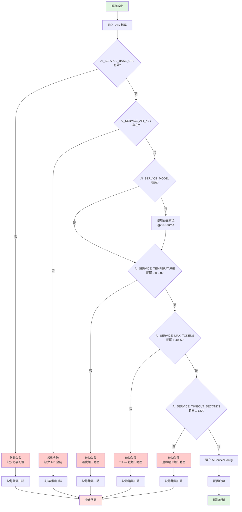
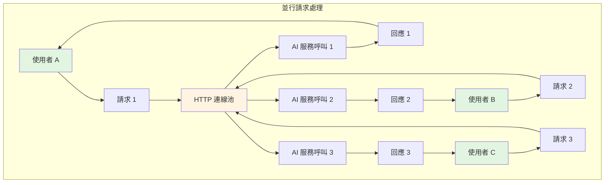
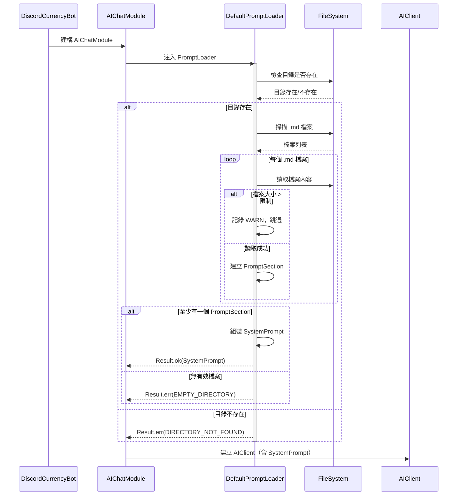
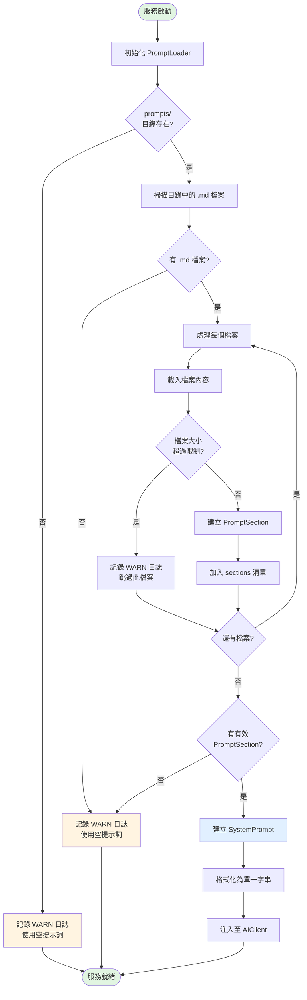

# AI Chat 流程架構

本文件詳細說明 LTDJMS Discord Bot 的 AI Chat 功能流程，包括訊息處理、AI 服務整合、錯誤處理與事件發布機制。

---

## 1. 高階流程圖



---

## 2. 元件互動圖



---

## 3. 資料流程圖

```mermaid
flowchart TD
    subgraph Input ["輸入階段"]
        UserMsg[使用者訊息<br/>「@Bot 你好」]
    end

    subgraph Processing ["處理階段"]
        Extract[提取純訊息<br/>「你好」]
        Build[建構 AIChatRequest<br/>model, messages, temperature, max_tokens]
        Serialize[序列化為 JSON]
    end

    subgraph Network ["網路傳輸"]
        Request[HTTP POST Request<br/>Content-Type: application/json<br/>Authorization: Bearer {API_KEY}]
    end

    subgraph AIService ["AI 服務處理"]
        AIProcess[AI 模型推理]
        AIGenerate[生成回應]
    end

    subgraph Response ["回應階段"]
        ResponseJSON[JSON 回應<br/>choices[0].message.content]
        Deserialize[反序列化 AIChatResponse]
        Validate[驗證回應內容]
    end

    subgraph Output ["輸出階段"]
        Split[智慧分割<br/>每則 ≤ 2000 字元]
        Send[發送 Discord 訊息]
        Display[顯示給使用者]
    end

    subgraph Monitoring ["監控階段"]
        Event[發布 AIMessageEvent]
        Log[記錄日誌<br/>MDC: channel_id, user_id, model]
    end

    UserMsg --> Extract
    Extract --> Build
    Build --> Serialize
    Serialize --> Request
    Request --> AIProcess
    AIProcess --> AIGenerate
    AIGenerate --> ResponseJSON
    ResponseJSON --> Deserialize
    Deserialize --> Validate
    Validate --> Split
    Split --> Send
    Send --> Display
    Validate --> Event
    Event --> Log

    style UserMsg fill:#e1f5e1
    style Display fill:#e1f5e1
    style AIProcess fill:#ffe1e1
    style Log fill:#fff4e1
```

---

## 4. 錯誤處理流程



**錯誤類型與日誌等級對應**：

| 錯誤類型 | DomainError.Category | 日誌等級 | 使用者看到訊息 |
|---------|---------------------|---------|---------------|
| HTTP 401 | `AUTHENTICATION_FAILED` | ERROR | `:x: AI 服務認證失敗，請聯絡管理員` |
| HTTP 429 | `RATE_LIMITED` | WARN | `:timer: AI 服務暫時忙碌，請稍後再試` |
| 連線逾時 | `TIMEOUT` | WARN | `:hourglass: AI 服務連線逾時，請稍後再試` |
| HTTP 5xx | `SERVICE_ERROR` | ERROR | `:warning: AI 回應格式錯誤` |
| 空回應 | `EMPTY_RESPONSE` | WARN | `:question: AI 沒有產生回應` |
| JSON 解析失敗 | `PARSE_ERROR` | ERROR | `:warning: AI 回應格式錯誤` |

---

## 5. 訊息分割演算法

當 AI 回應超過 Discord 訊息長度限制（2000 字元）時，`MessageSplitter` 會智慧分割訊息：



**分割原則**：
1. **段落優先**：優先在雙換行符（`\n\n`）處分割
2. **句子次之**：其次在句號、驚嘆號、問號處分割
3. **避免截斷**：盡量避免在單詞或程式碼中間分割
4. **安全邊界**：每個片段最多 1900 字元（預留 100 字元緩衝）

---

## 6. 事件發布與日誌記錄

### 6.1 AIMessageEvent 結構

當 AI 訊息成功發送後，系統會發布 `AIMessageEvent`：

```java
public class AIMessageEvent extends DomainEvent {
    private final String guildId;
    private final String channelId;
    private final String userId;
    private final String userMessage;
    private final String aiResponse;
    private final Instant timestamp;
}
```

### 6.2 結構化日誌格式

日誌使用 MDC (Mapped Diagnostic Context) 記錄關鍵資訊：

```json
{
  "timestamp": "2025-12-28T12:34:56.789Z",
  "level": "INFO",
  "logger": "ltdjms.discord.aichat.services.DefaultAIChatService",
  "message": "AI chat request completed",
  "mdc": {
    "channel_id": "1234567890",
    "user_id": "0987654321",
    "model": "gpt-3.5-turbo",
    "response_time_ms": 1234,
    "response_length": 156
  }
}
```

### 6.3 日誌等級使用原則

| 等級 | 使用場景 | 範例 |
|------|---------|------|
| ERROR | AI 服務認證失敗、伺服器錯誤、格式錯誤 | 認證失敗、JSON 解析失敗 |
| WARN | 速率限制、連線逾時、空回應 | HTTP 429、連線逾時、空內容 |
| INFO | AI 請求成功、回應時間 | 請求成功（含回應時間） |

---

## 7. 配置驗證流程



**配置驗證規則**：

| 變數名稱 | 必填 | 預設值 | 驗證規則 |
|---------|:----:|--------|---------|
| `AI_SERVICE_BASE_URL` | ✅ | 無 | 必須為有效 URL |
| `AI_SERVICE_API_KEY` | ✅ | 無 | 不可為空白 |
| `AI_SERVICE_MODEL` | ❌ | `gpt-3.5-turbo` | 無 |
| `AI_SERVICE_TEMPERATURE` | ❌ | `0.7` | 0.0 ≤ 值 ≤ 2.0 |
| `AI_SERVICE_MAX_TOKENS` | ❌ | `500` | 1 ≤ 值 ≤ 4096 |
| `AI_SERVICE_TIMEOUT_SECONDS` | ❌ | `30` | 1 ≤ 值 ≤ 120 |

---

## 8. 效能考量

### 8.1 並行處理



**並行處理特性**：
- **獨立處理**：每個請求獨立處理，互不干擾
- **連線池**：Java 17 HttpClient 自動管理連線池
- **無狀態**：不保存對話歷史，無需考慮並行衝突

### 8.2 效能指標

| 指標 | 目標值 | 測量方式 |
|------|--------|---------|
| AI 回應時間 | < 5 秒 (95th percentile) | 日誌 `response_time_ms` |
| 並行處理能力 | 100 個同時請求 | 壓力測試 |
| AI 服務成功率 | > 95% | 日誌錯誤率統計 |
| 錯誤回應時間 | < 3 秒 | 錯誤處理連線逾時設定 |

---

## 9. 提示詞載入流程（V015 新增）

### 9.1 提示詞載入時序圖



### 9.2 提示詞載入流程圖



### 9.3 提示詞載入錯誤處理

| 錯誤類型 | 觸發條件 | 日誌等級 | 系統行為 |
|---------|---------|----------|----------|
| `DIRECTORY_NOT_FOUND` | `PROMPTS_DIR_PATH` 目錄不存在 | WARN | 使用空提示詞，服務正常啟動 |
| `FILE_TOO_LARGE` | 單一檔案超過 `PROMPT_MAX_SIZE_BYTES` | WARN | 跳過該檔案，繼續處理其他檔案 |
| `READ_FAILED` | 檔案讀取失敗（權限問題等） | ERROR | 跳過該檔案，繼續處理其他檔案 |
| `EMPTY_DIRECTORY` | 目錄為空或無 `.md` 檔案 | WARN | 使用空提示詞，服務正常啟動 |

**設計原則**：
- **寬容失敗**：提示詞載入失敗不應阻止服務啟動
- **部分載入**：部分檔案失敗不影響其他有效檔案的載入
- **日誌記錄**：所有錯誤都會記錄日誌，方便問題排查

---

## 10. 相關文件

| 文件 | 說明 |
|------|------|
| [AI Chat 模組文件](../modules/aichat.md) | 模組概述與使用方式 |
| [AI Chat 時序圖](sequence-diagrams.md#9-ai-chat-提及回應流程v010-新增) | 詳細時序圖 |
| [AI Chat 規格](../../specs/003-ai-chat/spec.md) | 功能規格與驗收標準 |
| [AI Chat 實作計畫](../../specs/003-ai-chat/plan.md) | 實作計畫與技術決策 |
| [AI Chat API 契約](../../specs/003-ai-chat/contracts/openapi.yaml) | AI 服務 API 規格 |
| [AI Chat 快速入門](../../specs/003-ai-chat/quickstart.md) | 快速開始指南 |
| [外部提示詞載入器規格](../../specs/004-external-prompts-loader/spec.md) | V015 新增功能規格 |
| [外部提示詞載入器實作計畫](../../specs/004-external-prompts-loader/plan.md) | V015 實作計畫 |
