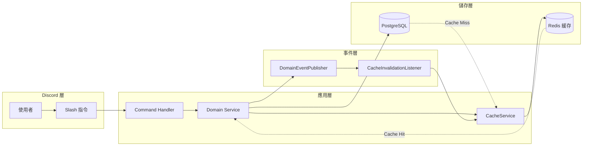
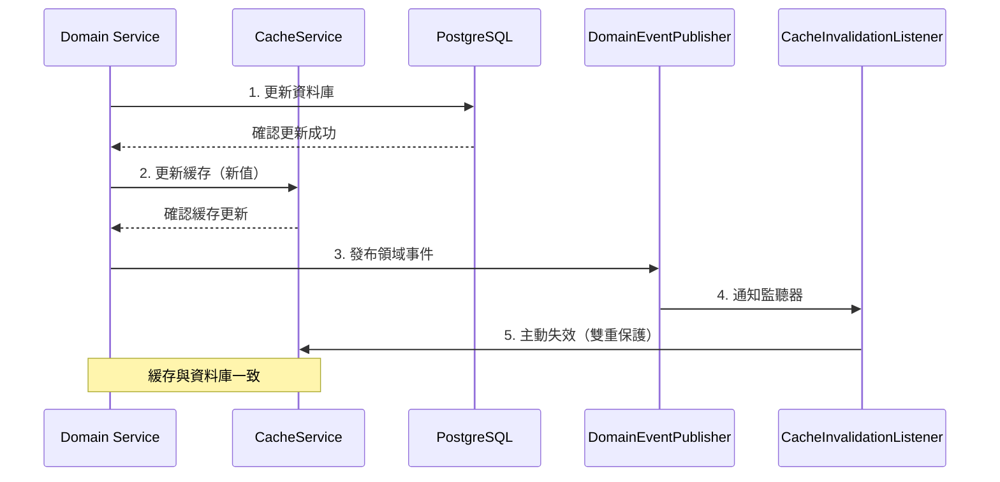
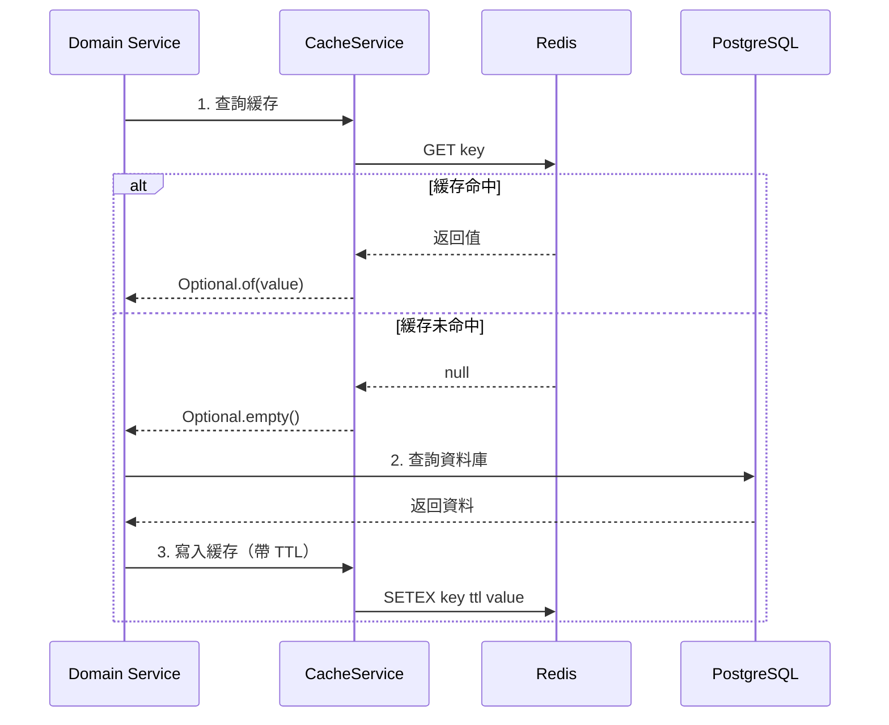
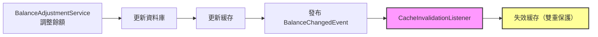
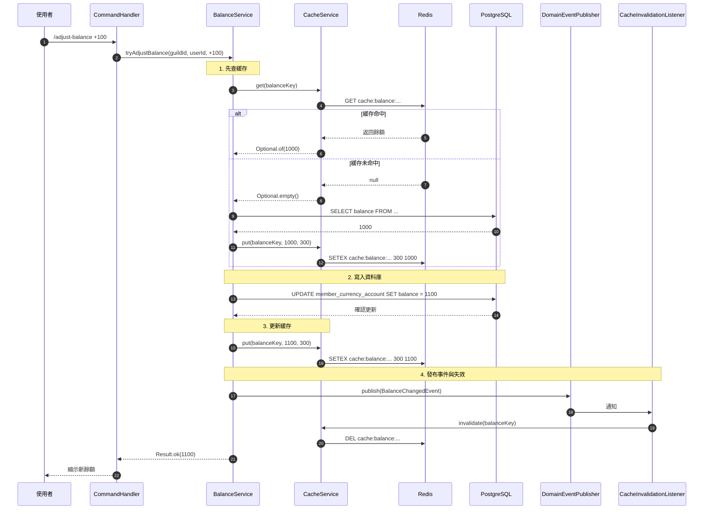

# 緩存架構詳解

本文件深入說明 LTDJMS 緩存系統的架構設計、一致性保證與效能優化策略。

## 1. 架構概觀

緩存系統採用**單層 Redis 緩存**架構，作為資料庫的前置快取層，提供最終一致性保證。



### 1.1 設計原則

| 原則 | 說明 | 實作方式 |
|------|------|----------|
| **失敗優雅降級** | 緩存故障不影響主流程 | 所有緩存操作捕獲例外，返回空值 |
| **最終一致性** | 允許短暫不一致，依賴 TTL 與事件失效 | TTL + 事件驅動失效雙重機制 |
| **單一真實來源** | 資料庫為 SSOT，緩存僅為快取 | 讀取先查緩存，寫入先寫資料庫 |
| **介面抽象** | 緩存實作可替換 | `CacheService` 介面 + `NoOpCacheService` 降級 |

---

## 2. 核心組件

### 2.1 介面層

**CacheService.java** - 統一的緩存操作介面：

```java
public interface CacheService {
    <T> Optional<T> get(String key, Class<T> type);
    <T> void put(String key, T value, int ttlSeconds);
    void invalidate(String key);
}
```

設計考量：
- **泛型支援**：支援 `Long`、`String`、`Integer` 等基本類型
- **TTL 控制**：每次寫入可指定過期時間
- **Optional 返回**：明確表示可能不存在的情況

### 2.2 實作層

**RedisCacheService.java** - Lettuce 用戶端實作：

```java
public class RedisCacheService implements CacheService {
    private final RedisClient redisClient;
    private final StatefulRedisConnection<String, String> connection;

    // get() - 使用 GET 指令
    // put() - 使用 SETEX 指令（帶 TTL）
    // invalidate() - 使用 DEL 指令
}
```

**NoOpCacheService.java** - 無操作降級實作：

```java
public class NoOpCacheService implements CacheService {
    // 所有方法返回空值或無操作
    // 用於 Redis 不可用時的降級
}
```

### 2.3 鍵管理層

**CacheKeyGenerator.java** - 統一鍵格式：

```java
public interface CacheKeyGenerator {
    String NAMESPACE = "cache";
    String balanceKey(long guildId, long userId);
    String gameTokenKey(long guildId, long userId);
}
```

**鍵格式規範**：
```
{namespace}:{entityType}:{guildId}:{userId}
```

範例：
- 貨幣餘額：`cache:balance:123456:789012`
- 遊戲代幣：`cache:gametoken:123456:789012`

---

## 3. 一致性模型

### 3.1 寫入流程

採用 **Write-Through + Event-Driven Invalidation** 模式：



**關鍵設計**：
1. **先寫資料庫**：確保 SSOT 先更新
2. **後更新緩存**：資料庫成功後才更新緩存
3. **發布事件**：通知其他服務節點
4. **事件失效**：作為雙重保護機制

### 3.2 讀取流程

採用 **Cache-Aside** 模式：



### 3.3 TTL 設定策略

| 資料類型 | TTL | 設定理由 |
|---------|-----|----------|
| 貨幣餘額 | 300 秒（5 分鐘） | 變更頻率相對較低，配合事件失效 |
| 遊戲代幣 | 300 秒（5 分鐘） | 同上 |

**TTL 選擇考量**：
- **太短**：緩存命中率下降，失去效益
- **太長**：不一致風險增加
- **5 分鐘**：在效能與一致性間取得平衡

---

## 4. 事件驅動失效

### 4.1 失效監聽器

**CacheInvalidationListener.java** 監聽以下事件：

```java
public class CacheInvalidationListener {
    public void onBalanceChanged(BalanceChangedEvent event) {
        String key = keyGenerator.balanceKey(event.guildId(), event.userId());
        cacheService.invalidate(key);
    }

    public void onGameTokenChanged(GameTokenChangedEvent event) {
        String key = keyGenerator.gameTokenKey(event.guildId(), event.userId());
        cacheService.invalidate(key);
    }
}
```

### 4.2 事件流程



**為何需要雙重保護？**
1. **多節點部署**：其他節點的緩存需要失效
2. **延遲失效**：確保即使在異常情況下緩存最終會失效
3. **事件可靠性**：即使事件發布失敗，TTL 仍會保證最終一致性

---

## 5. 依賴注入組裝

### 5.1 CacheModule

```java
@Module
public class CacheModule {
    @Provides
    @Singleton
    public CacheService provideCacheService(EnvironmentConfig config) {
        String redisUri = config.getRedisUri();
        if (redisUri != null && !redisUri.isBlank()) {
            return new RedisCacheService(redisUri);
        }
        return new NoOpCacheService();
    }

    @Provides
    @Singleton
    public CacheKeyGenerator provideCacheKeyGenerator() {
        return new DefaultCacheKeyGenerator();
    }

    @Provides
    @Singleton
    public CacheInvalidationListener provideCacheInvalidationListener(
        CacheService cacheService,
        CacheKeyGenerator keyGenerator
    ) {
        return new CacheInvalidationListener(cacheService, keyGenerator);
    }
}
```

### 5.2 DI 自動組裝

**EventModule.java / CacheModule.java**：

```java
@Module
public abstract class EventModule {
    @Multibinds
    abstract Set<Consumer<DomainEvent>> domainEventListeners();

    @Provides
    @Singleton
    static DomainEventPublisher provideDomainEventPublisher(
        Set<Consumer<DomainEvent>> listeners
    ) {
        return new DomainEventPublisher(listeners);
    }
}

@Module
public class CacheModule {
    @Provides
    @IntoSet
    public Consumer<DomainEvent> provideCacheInvalidationDomainEventListener(
        CacheInvalidationListener listener
    ) {
        return listener;
    }
}
```

`DiscordCurrencyBot` 不再手動註冊快取監聽器；所有事件監聽器都由 Dagger multibinding 組裝進同一個 `DomainEventPublisher`。

---

## 6. 效能考量

### 6.1 序列化選擇

使用 **String 序列化**：
- ✅ 簡單直接，無需額外框架
- ✅ Redis 原生支援
- ✅ 便於除錯（可用 `redis-cli` 查看）
- ✅ 跨語言相容

**不使用 Binary 序列化**的原因：
- ❌ Java 序列化有安全風險
- ❌ 跨語言相容性差
- ❌ 除錯困難

### 6.2 連線管理

**Lettuce 連線配置**：

```java
RedisClient redisClient = RedisClient.create(uri);
StatefulRedisConnection<String, String> connection = redisClient.connect();
```

**特性**：
- 非阻塞 I/O（基於 Netty）
- 單一連線，多執行緒共用
- 自動重連

### 6.3 命中率優化

| 優化策略 | 說明 |
|---------|------|
| 適當的 TTL | 平衡命中與一致性 |
| 事件失效 | 減少不一致窗口 |
| 鍵命名規範 | 避免衝突，便於清理 |
| 讀多寫少場景優先 | 貨幣餘額、遊戲代幣 |

---

## 7. 故障處理

### 7.1 故障場景

| 故障類型 | 症狀 | 處理方式 | 影響 |
|---------|------|----------|------|
| Redis 連線失敗 | 例外拋出 | 捕獲例外，返回空 | 自動降級至直接查 DB |
| Redis 記憶體不足 | OOM 錯誤 | 捕獲例外，返回空 | 短暫效能下降 |
| 網絡延遲 | 請求超時 | 捕獲例外，返回空 | 緩存未命中 |

### 7.2 降級策略

**NoOpCacheService**：
```java
public class NoOpCacheService implements CacheService {
    @Override
    public <T> Optional<T> get(String key, Class<T> type) {
        return Optional.empty(); // 永遠返回空
    }

    @Override
    public <T> void put(String key, T value, int ttlSeconds) {
        // 無操作
    }

    @Override
    public void invalidate(String key) {
        // 無操作
    }
}
```

**啟用條件**：
- `REDIS_URI` 未設定或為空
- Redis 連線初始化失敗

---

## 8. 監控與維護

### 8.1 日誌關鍵點

```java
// 初始化日誌
logger.info("Redis 緩存服務已初始化，連線至 {}", redisUri);

// 緩存命中日誌（DEBUG）
logger.debug("緩存已設定，key: {}, TTL: {} 秒", key, ttlSeconds);

// 錯誤日誌
logger.error("從緩存獲取值失敗，key: {}", key, e);
```

### 8.2 Redis 監控指令

```bash
# 查看緩存命中率
redis-cli info stats | grep keyspace_hits

# 查看記憶體使用
redis-cli info memory

# 查看連線數
redis-cli info clients

# 查看特定鍵
redis-cli GET "cache:balance:123456:789012"

# 清空所有緩存（危險！）
redis-cli FLUSHDB
```

### 8.3 常見運維操作

```bash
# 查看貨幣餘額緩存
redis-cli KEYS "cache:balance:*"

# 失效特定使用者緩存
redis-cli DEL "cache:balance:123456:789012"

# 失效整個伺服器的緩存
redis-cli --scan --pattern "cache:*:123456:*" | xargs redis-cli DEL
```

---

## 9. 擴充建議

### 9.1 未來改進方向

| 改進項目 | 說明 | 優先級 |
|---------|------|--------|
| **快取預熱** | 啟動時預載熱點資料 | 低 |
| **多層緩存** | 本地 Caffeine + Redis | 低 |
| **布隆過濾器** | 防止緩存穿透 | 低 |
| **監控指標** | 命中率、延遲統計 | 中 |
| **動態 TTL** | 根據訪問頻率調整 | 低 |

### 9.2 新增實體類型

若要為新的實體類型添加緩存：

1. **擴展 CacheKeyGenerator**：
```java
String xpKey(long guildId, long userId);
```

2. **實作服務層**：
```java
// 在 Service 中添加
getCachedXp(guildId, userId) {
    return cacheService.get(keyGenerator.xpKey(guildId, userId), Long.class)
        .orElseGet(() -> {
            long xp = repository.findXp(guildId, userId);
            cacheService.put(keyGenerator.xpKey(guildId, userId), xp, 300);
            return xp;
        });
}
```

3. **添加失效事件**：
```java
public record XpChangedEvent(long guildId, long userId, long newXp) implements DomainEvent {}
```

---

## 10. 時序圖：完整緩存流程



---

本架構文件與 `docs/modules/cache.md` 互補：
- **cache.md**：著重於使用方式與配置
- **cache-architecture.md**（本文）：著重於設計原理與架構決策
