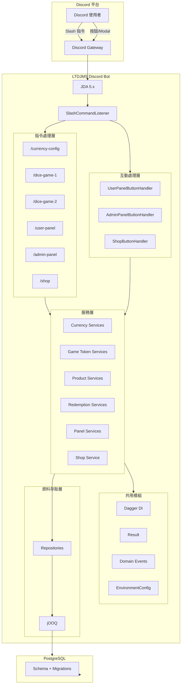
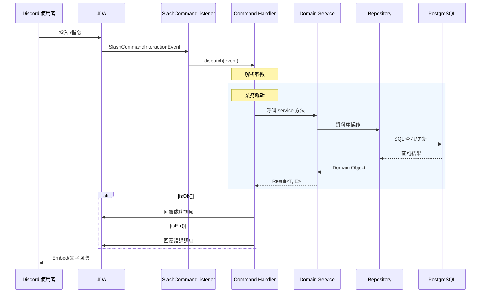
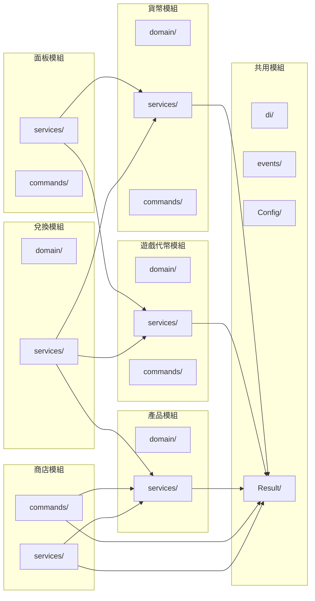
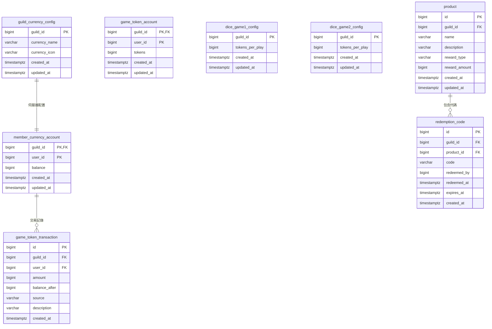
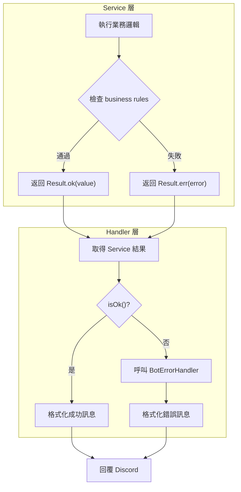
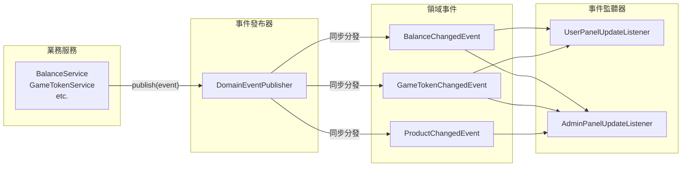

# 系統架構圖

本文件使用 Mermaid 圖表展示 LTDJMS 的系統架構、請求流程與模組關係。

## 1. 高階系統架構圖

## 2. 請求處理流程圖

## 3. 模組關係圖

## 4. 資料庫 Schema 關係圖

## 5. 面板互動流程圖

```mermaid
flowchart TD
    subgraph UserPanel["/user-panel 流程"]
        UP1["使用者輸入 /user-panel"]
        UP2["UserPanelCommandHandler 處理"]
        UP3["UserPanelService 取得餘額資料"]
        UP4["顯示餘額 Embed + 流水按鈕"]
        UP5["使用者點擊流水按鈕"]
        UP6["UserPanelButtonHandler 處理"]
        UP7["GameTokenTransactionService 取得分頁資料"]
        UP8["顯示流水 Embed + 分頁按鈕"]
    end

    subgraph AdminPanel["/admin-panel 流程"]
        AP1["管理員輸入 /admin-panel"]
        AP2["AdminPanelCommandHandler 處理"]
        AP3["顯示管理面板 Embed + 功能按鈕"]

        AP4A["點擊餘額管理"]
        AP4B["點擊代幣管理"]
        AP4C["點擊遊戲設定"]
        AP4D["點擊產品管理"]

        AP5A["顯示餘額調整 Modal"]
        AP5B["顯示代幣調整 Modal"]
        AP5C["顯示遊戲選擇選單 → Modal"]
        AP5D["顯示產品管理面板"]

        AP6["管理員填寫表單"]
        AP7["AdminPanelButtonHandler 處理"]
        AP8["呼叫對應 Service 執行操作"]
        AP9["顯示操作結果"]
    end

    UP1 --> UP2 --> UP3 --> UP4 --> UP5 --> UP6 --> UP7 --> UP8
    AP1 --> AP2 --> AP3
    AP3 --> AP4A --> AP5A --> AP6 --> AP7 --> AP8 --> AP9
    AP3 --> AP4B --> AP5B --> AP6 --> AP7 --> AP8 --> AP9
    AP3 --> AP4C --> AP5C --> AP6 --> AP7 --> AP8 --> AP9
    AP3 --> AP4D --> AP5D --> AP6 --> AP7 --> AP8 --> AP9
```

## 6. 錯誤處理流程圖

## 7. 領域事件發布流程圖

---

以上圖表涵蓋了 LTDJMS 的核心架構概念。如需更詳細的模組內部結構，請參考各模組的專屬文件。
