# 系統架構總覽

本文件說明 LTDJMS Discord Bot 的整體架構與主要元件，協助開發者快速了解請求從 Discord 傳入到資料庫與回應的完整路徑。

## 1. 高階架構

從 Discord 使用者視角到後端的流程可以概略表示如下：

```mermaid
flowchart LR
  User["Discord 使用者\n(發送 / 指令或按鈕)"]
  Discord["Discord API / Gateway"]
  Bot["JDA Bot\n(DiscordCurrencyBot)"]
  Listener["SlashCommandListener\n+ Button Handlers"]
  Handler["Command Handlers\n(currency-config, dice-game-1, user-panel, ... )"]
  Service["Domain Services\n(BalanceService, GameTokenService, ...)"]
  Repo["Repositories\n(Jdbc*/Jooq*Repository)"]
  DB["PostgreSQL\n(currency_bot)"]

  User --> Discord --> Bot --> Listener --> Handler --> Service --> Repo --> DB
  Repo --> Service --> Handler --> Listener --> Bot --> Discord --> User
```

### 1.1 主要技術堆疊

- **JDA 5.x**：與 Discord 溝通的 Java Discord API。
- **Dagger 2**：依賴注入框架，透過 `AppComponent` 組裝所有服務與 Repository。
- **PostgreSQL**：資料儲存，schema 定義在 `src/main/resources/db/schema.sql`。
- **Flyway**：資料庫 migration 管理，migration 檔案位於 `src/main/resources/db/migration/`。
- **JDBC / jOOQ**：資料存取層，提供型別安全的 SQL 操作。
- **Typesafe Config**：設定載入與合併（環境變數、`.env`、`application.conf` 等）。

## 2. 啟動流程

應用程式的入口點位於：

- `src/main/java/ltdjms/discord/currency/bot/DiscordCurrencyBot.java`

啟動順序概略如下：

1. 建立 `EnvironmentConfig`，從環境變數／`.env`／設定檔載入設定。
2. 使用 `AppComponentFactory.create(envConfig)` 建立 Dagger `AppComponent`。
3. 從 `AppComponent` 取得：
   - `DatabaseConfig` 與 `DataSource`
   - 各種服務（`BalanceService`、`GameTokenService` 等）
   - 指令與面板的 handler（包括 `SlashCommandListener`、`UserPanelButtonHandler`、`AdminPanelButtonHandler`）。
4. 呼叫 `DatabaseMigrationRunner.forDefaultMigrations().migrate(dataSource)`：
   - 使用 Flyway 執行 `src/main/resources/db/migration/` 下的所有 pending migrations
   - 若是空資料庫，會建立完整 schema
   - 若是既有資料庫，會套用任何新增的 migration
   - 若 migration 失敗則中止啟動並拋出 `SchemaMigrationException`
5. 透過 `JDABuilder.createLight(envConfig.getDiscordBotToken())` 建立 JDA：
   - 使用非特權 Gateway Intents，避免因 Bot 未啟用特權 Intents 而無法連線
   - 註冊 `SlashCommandListener` 及面板按鈕 handler
6. 等待 JDA 就緒後，呼叫 `SlashCommandListener.registerCommands(jda)` 將所有 slash commands 註冊到 Discord。

## 3. 模組與分層

### 3.1 Package 結構

在 `src/main/java/ltdjms/discord` 下，主要模組分為：

- `currency/`  
  伺服器貨幣系統：帳戶、餘額查詢、餘額調整、貨幣設定與相關指令 handler。

- `gametoken/`  
  遊戲代幣與小遊戲：代幣帳戶、代幣調整、骰子遊戲 1/2 設定與服務，以及代幣交易紀錄。

- `panel/`  
   使用者面板與管理面板：`/user-panel`、`/admin-panel` 指令與各種按鈕、Modal 處理邏輯。

- `product/`  
   產品定義與管理：產品資料模型、產品服務與相關資料庫操作。

- `redemption/`  
   兌換系統：兌換碼生成、驗證與兌換邏輯，以及與產品的整合。

- `shared/`
  共用基礎設施：資料庫連線設定、Flyway schema migration、`Result<T, E>` 型別、`DomainError`、設定載入與 Dagger DI 定義。

### 3.2 分層設計

每個功能模組大致遵守以下分層：

- `domain/`  
  - 領域模型（例如 `MemberCurrencyAccount`、`GameTokenAccount` 等）
  - 不包含基礎設施細節，專注在商業規則（例如餘額不得為負）。

- `persistence/`  
  - Repository 介面與 JDBC/jOOQ 實作（例如 `JdbcMemberCurrencyAccountRepository`）
  - 負責將 domain 物件映射到資料庫表格。

- `services/`  
  - 業務邏輯服務（例如 `BalanceService`、`GameTokenService`、`DiceGame1Service`）
  - 負責組合多個 repository 與 domain 行為，形成高階操作。

- `commands/`  
  - 對應每個 slash command 的 handler（例如 `CurrencyConfigCommandHandler`、`DiceGame1CommandHandler`、`UserPanelCommandHandler` 等）
  - 接收 JDA 事件，轉換為服務呼叫與 Discord 回應。

這樣的分層有助於：

- 測試時可以對 service 層做單元測試、對 repository 做整合測試。
- 未來若要更換資料庫或調整 JDA 版本，只需局部修改。

## 4. Dagger 依賴注入

主組件定義在：

- `src/main/java/ltdjms/discord/shared/di/AppComponent.java`

其職責包含：

- 暴露基礎設施：
  - `EnvironmentConfig`
  - `DatabaseConfig`
  - `DataSource`
  - `DSLContext`（jOOQ）
- 提供所有服務與 repository 的 singleton 實例。
- 建立並注入各種 command handler 與 panel handler。

在 `DiscordCurrencyBot` 中只需要呼叫 `AppComponentFactory.create(envConfig)`，即可取得完整 wiring 的 `AppComponent`，避免手工 new 與依賴管理。

## 5. 請求處理流程示例

> 註：舊版的 `/balance`、`/adjust-balance` 等指令已不再作為獨立 slash commands 註冊，其核心邏輯仍存在於服務層，並由 `/user-panel` 與 `/admin-panel` 封裝使用。

### 5.1 `/dice-game-1` 指令

1. 使用者輸入 `/dice-game-1`。
2. `SlashCommandListener` 將事件轉發到 `DiceGame1CommandHandler`。
3. `DiceGame1CommandHandler`：
   - 讀取該 guild 的 `DiceGame1Config`（tokensPerPlay）
   - 檢查玩家是否有足夠遊戲代幣（透過 `GameTokenService`）
   - 若足夠，呼叫 `GameTokenService.tryDeductTokens` 扣除代幣
   - 呼叫 `DiceGame1Service.play` 進行骰子遊戲，計算獎勵與更新貨幣帳戶
   - 查詢伺服器貨幣設定（`GuildCurrencyConfigRepository`）以取得名稱與圖示
   - 將結果格式化成 Discord 訊息並回覆
   - 同時透過 `GameTokenTransactionService` 記錄代幣消耗的交易紀錄

### 5.2 `/admin-panel` 指令與面板互動

1. 管理員輸入 `/admin-panel`。
2. `SlashCommandListener` 呼叫 `AdminPanelCommandHandler.handle`：
    - 回覆一個僅管理員可見的 Embed（管理面板首頁）
    - 附加按鈕包括：「使用者餘額管理」、「遊戲代幣管理」、「遊戲設定管理」、「產品管理」
3. 使用者點擊「產品管理」按鈕：
    - JDA 觸發 `AdminPanelButtonHandler.onButtonInteraction`
    - 顯示產品列表或新增產品的表單（Modal）
4. 管理員在 Modal 中填寫產品資訊並送出：
    - `AdminPanelButtonHandler.onModalInteraction` 呼叫 `AdminProductPanelHandler` 處理
    - 透過 `ProductService` 新增產品，並自動生成兌換碼（若需要）
    - 再依結果回覆成功或錯誤訊息

### 5.3 `/user-panel` 指令

1. 成員在伺服器輸入 `/user-panel`。
2. `SlashCommandListener` 將事件轉發到 `UserPanelCommandHandler`。
3. `UserPanelCommandHandler`：
   - 透過 `UserPanelService.getUserPanelView` 讀取貨幣餘額、遊戲代幣餘額與貨幣設定。
   - 將結果組成 Embed（包含貨幣與代幣欄位），並附上「查看遊戲代幣流水」按鈕。
   - 以 ephemeral 訊息回覆。
4. 後續按鈕互動由 `UserPanelButtonHandler` 處理，載入 `GameTokenTransactionService` 提供的交易分頁資料。

## 6. 錯誤處理與 Result 模式

專案大量運用 `Result<T, DomainError>` 來處理可預期的業務錯誤：

- `Result.ok(value)` 代表成功結果
- `Result.err(domainError)` 代表失敗，錯誤類型由 `DomainError.Category` 區分：
  - `INVALID_INPUT`
  - `INSUFFICIENT_BALANCE`
  - `INSUFFICIENT_TOKENS`
  - `PERSISTENCE_FAILURE`
  - `UNEXPECTED_FAILURE`

Command handler 通常遵守以下模式：

1. 呼叫 service 方法，取得 `Result<*, DomainError>`。
2. 若 `isErr()`：
   - 呼叫 `BotErrorHandler.handleDomainError(event, error)`，將錯誤轉成適當 Discord 訊息（多半為 ephemeral）。
3. 若 `isOk()`：
   - 正常回覆 Discord 訊息，並呼叫 `BotErrorHandler.logSuccess` 記錄成功。

如此可以：

- 把「預期錯誤」（例如餘額不足、輸入無效）與「非預期錯誤」（例外、資料庫問題）清楚區分。
- 減少在 handler 中做複雜的 try-catch，讓業務邏輯集中在 service 層。

## 7. 指令 Metrics 與觀測性

為了在實際環境中監控指令延遲與錯誤率，`SlashCommandListener` 會在處理每一個 slash 指令時使用 `SlashCommandMetrics`：

- 在收到指令時建立一個 metrics context，紀錄指令名稱與開始時間。
- 在正常回應或發生錯誤後，呼叫對應的「成功／失敗」記錄方法，計算耗時並寫入日誌。
- 日誌中會包含指令名稱、處理結果（成功／錯誤）與執行時間，方便後續以 log-based 方式進行監控與效能分析。

這套 metrics 機制目前主要以 Logback console log 為輸出目標，但設計上與 command handler 解耦，未來若需要接入外部監控系統（如 Prometheus、雲端監控服務）時，可在不改動 handler 的前提下擴充 `SlashCommandMetrics` 的實作。

## 8. 架構圖參考

本文件的文字描述可搭配以下視覺化圖表閱讀：

- **[系統架構圖](component-diagram.md)** - 完整的 Mermaid 架構圖、模組關係圖、資料庫 schema 圖與互動流程圖

---

若你打算新增新的 slash command 或面板功能，建議先閱讀：

- `docs/modules/currency-system.md`
- `docs/modules/game-tokens-and-games.md`
- `docs/modules/panels.md`
- `docs/modules/product.md`
- `docs/modules/redemption.md`

了解現有模組的分層與模式後，再依樣擴充會更順手。
