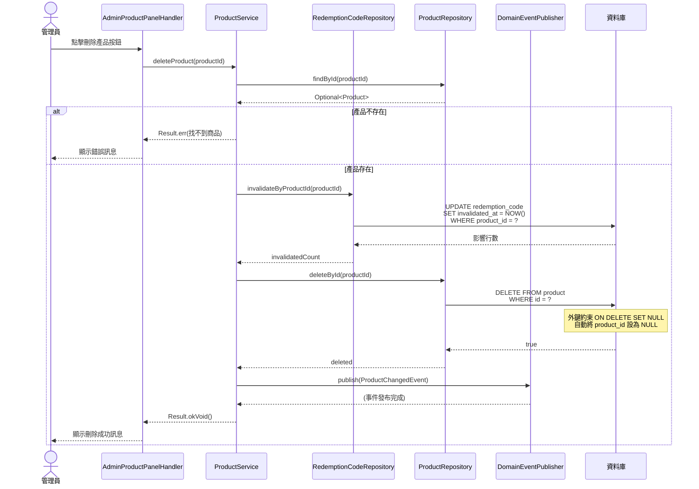
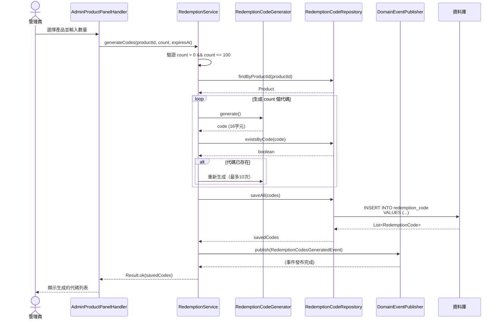
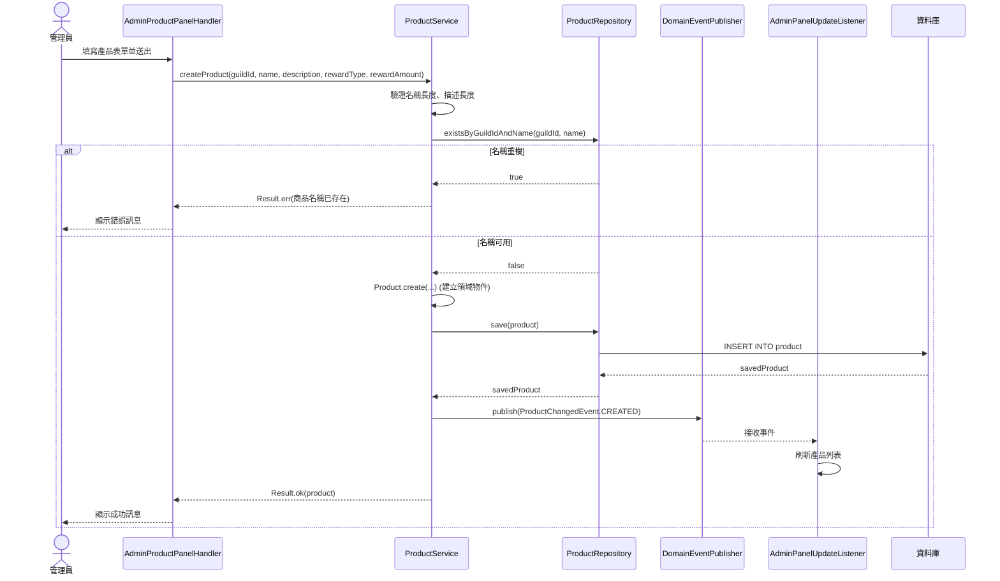
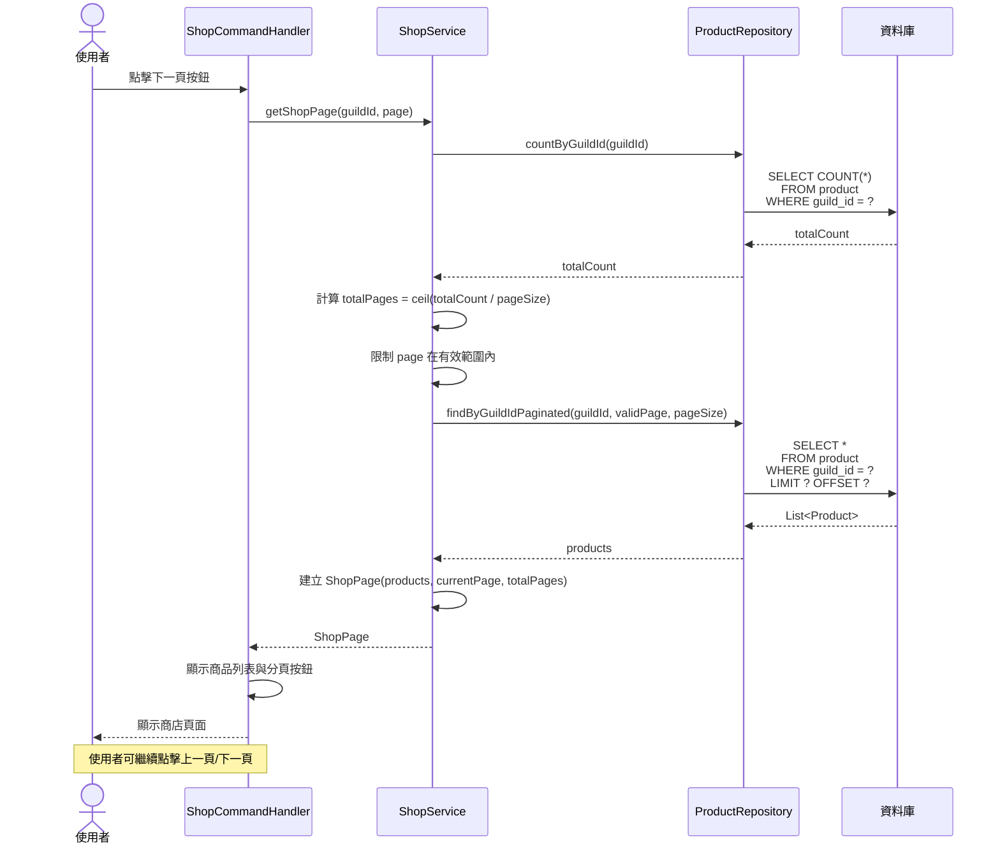
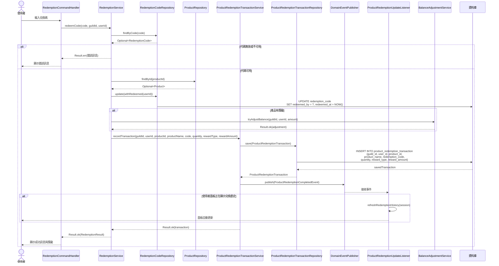
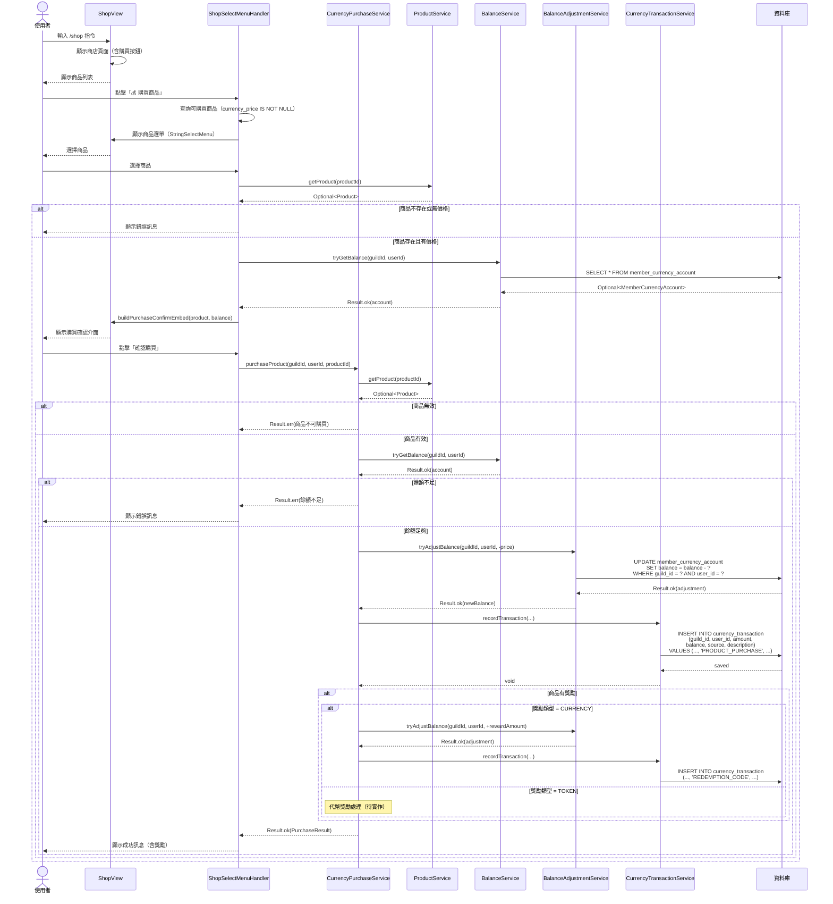
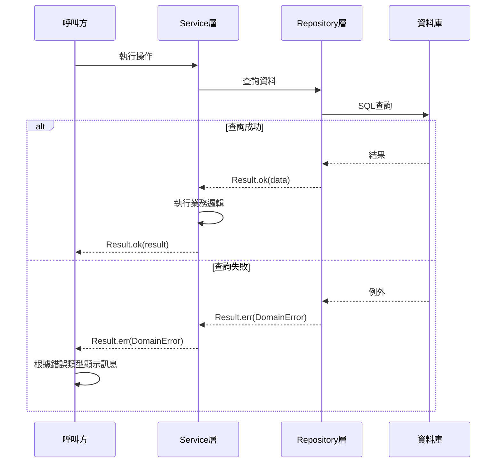
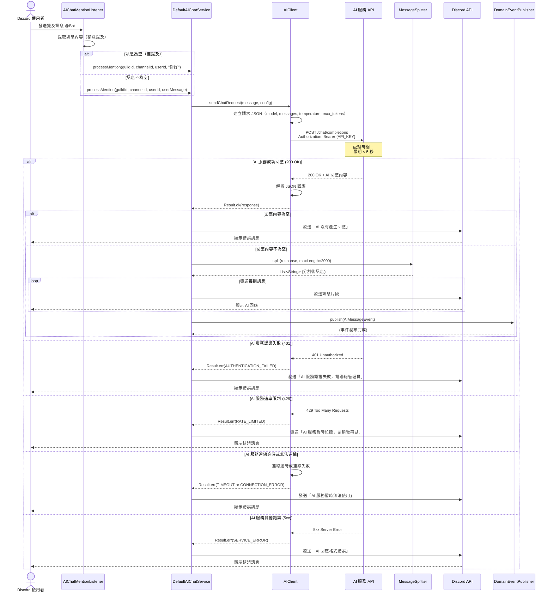

# 時序圖說明

本文件提供 LTDJMS Discord Bot 核心業務流程的時序圖（Sequence Diagrams），協助開發者理解系統內部元件之間的互動方式。

## 1. 產品刪除流程

當管理員刪除產品時，系統會自動失效所有關聯的兌換碼：



**關鍵點**：
1. 先失效兌換碼，再刪除產品（確保資料一致性）
2. 外鍵約束 `ON DELETE SET NULL` 會自動將 `product_id` 設為 NULL
3. 發布 `ProductChangedEvent` 通知其他模組（如管理員面板）更新狀態

---

## 2. 兌換碼生成流程

當管理員為產品生成兌換碼時：



**關鍵點**：
1. 單次最多生成 100 個代碼（`MAX_BATCH_SIZE`）
2. 生成時檢查唯一性，最多重試 10 次
3. 發布 `RedemptionCodesGeneratedEvent` 通知管理員面板即時更新統計

---

## 3. 兌換碼兌換流程

當使用者使用兌換碼時：

```mermaid
sequenceDiagram
    actor User as 使用者
    participant Handler as RedemptionCommandHandler
    participant Service as RedemptionService
    participant RCodeRepo as RedemptionCodeRepository
    participant PRepo as ProductRepository
    participant BalanceSvc as BalanceAdjustmentService
    participant TokenSvc as GameTokenService
    participant TxnSvc as CurrencyTransactionService
    participant DB as 資料庫

    User->>Handler: 輸入兌換碼
    Handler->>Service: redeemCode(code, guildId, userId)

    Service->>Service: 驗證並正規化代碼
    Service->>RCodeRepo: findByCode(code)
    RCodeRepo-->>Service: Optional<RedemptionCode>

    alt 代碼不存在
        Service-->>Handler: Result.err(兌換碼無效)
        Handler-->>User: 顯示錯誤訊息
    else 代碼存在
        Service->>Service: 檢查狀態
        Note over Service: isValid() =<br/>!isInvalidated() &&<br/>!isRedeemed() &&<br/>!isExpired()

        alt 代碼已失效
            Service-->>Handler: Result.err(此兌換碼已失效)
        alt 代碼已兌換
            Service-->>Handler: Result.err(此兌換碼已被使用)
        alt 代碼已過期
            Service-->>Handler: Result.err(此兌換碼已過期)
        else 代碼可用
            Service->>Service: 檢查 productId 是否為 NULL

            alt productId 為 NULL
                Service-->>Handler: Result.err(此兌換碼已失效)
            else productId 不為 NULL
                Service->>PRepo: findById(productId)
                PRepo-->>Service: Optional<Product>

                alt 產品不存在
                    Service-->>Handler: Result.err(商品資料異常)
                else 產品存在
                    Service->>RCodeRepo: update(withRedeemed(userId))
                    RCodeRepo->>DB: UPDATE redemption_code<br/>SET redeemed_by = ?,<br/>redeemed_at = NOW()
                    DB-->>RCodeRepo: updated

                    alt 產品有獎勵
                        alt 獎勵類型 = CURRENCY
                            Service->>BalanceSvc: tryAdjustBalance(guildId, userId, amount)
                            BalanceSvc-->>Service: Result<BalanceAdjustment, DomainError>
                            Service->>TxnSvc: recordTransaction(...)
                            TxnSvc->>DB: INSERT INTO currency_transaction
                        else 獎勵類型 = TOKEN
                            Service->>TokenSvc: tryAdjustTokens(guildId, userId, amount)
                            TokenSvc-->>Service: Result<TokenAdjustment, DomainError>
                            Service->>TxnSvc: recordTransaction(...)
                            TxnSvc->>DB: INSERT INTO game_token_transaction
                        end
                    end

                    Service-->>Handler: Result.ok(RedemptionResult)
                    Handler-->>User: 顯示成功訊息與獎勵
                end
            end
        end
    end
```

**關鍵點**：
1. 多層次驗證：代碼存在、伺服器、失效狀態、兌換狀態、過期狀態
2. 檢查 `productId` 是否為 NULL（產品是否已被刪除）
3. 根據 `RewardType` 發放對應獎勵（貨幣或代幣）
4. 記錄交易流水以便追蹤

---

## 4. 產品建立與事件發布

當管理員建立新產品時：



**關鍵點**：
1. 先驗證名稱唯一性，再建立產品
2. 使用靜態工廠方法 `Product.create()` 建立領域物件
3. 發布 `ProductChangedEvent` 通知監聽器更新顯示

---

## 5. 商店分頁瀏覽流程

當使用者瀏覽商店時：



**關鍵點**：
1. 先查詢總數以計算總頁數
2. 確保 page 參數在有效範圍內（避免越界）
3. 使用 `LIMIT/OFFSET` 進行分頁查詢

---

## 6. 商品兌換完整流程（V008 新增）

當使用者使用兌換碼並建立交易記錄時：



**關鍵點**（V008 新增）：
1. **交易記錄**：每次兌換都會建立 `ProductRedemptionTransaction` 記錄
2. **產品名稱快照**：交易記錄保存 `product_name`，即使產品被刪除仍可顯示
3. **事件發布**：發布 `ProductRedemptionCompletedEvent` 觸發面板即時更新
4. **遮蔽代碼**：顯示時只顯示前後 4 碼（如 `ABCD****1234`）
5. **面板更新**：如果使用者正在查看兌換歷史，面板會自動刷新

---

## 7. 貨幣購買商品流程（V009 新增）

當使用者使用貨幣直接購買商品時：



**關鍵點**（V009 新增）：
1. **商品篩選**：只顯示 `currency_price IS NOT NULL` 的商品
2. **餘額檢查**：購買前顯示當前餘額與購買後餘額
3. **交易記錄**：購買交易記錄為 `Source.PRODUCT_PURCHASE`
4. **獎勵發放**：若商品有獎勵，購買後自動發放至使用者帳戶
5. **獎勵交易**：獎勵發放記錄為 `Source.REDEMPTION_CODE`（重用現有來源）
6. **代幣獎勵**：目前僅支援貨幣獎勵，代幣獎勵待實作

---

## 8. 錯誤處理模式

系統統一使用 `Result<T, DomainError>` 處理錯誤：



**錯誤類型**：
- `INVALID_INPUT`: 使用者輸入錯誤（如代碼不存在、名稱重複）
- `PERSISTENCE_FAILURE`: 資料庫操作失敗
- `UNEXPECTED_FAILURE`: 非預期錯誤

---

## 9. AI Chat 提及回應流程（V010 新增）

當使用者在 Discord 頻道中提及機器人時，系統會呼叫 AI 服務生成回應：



**關鍵點**（V010 新增）：
1. **提及檢測**：JDA `GenericEventMonitor` 監聽 `MessageReceivedEvent`，檢查訊息是否包含機器人提及
2. **訊息提取**：移除機器人提及部分，提取使用者實際輸入的訊息
3. **預設問候**：若訊息為空（僅提及），使用預設問候語「你好」
4. **AI 服務呼叫**：使用 Java 17 `HttpClient` 呼叫 OpenAI 相容 API
5. **無狀態設計**：每次請求獨立，不保存對話歷史
6. **訊息分割**：使用 `MessageSplitter` 智慧分割長回應（Discord 2000 字元限制）
7. **錯誤分類**：依 HTTP 狀態碼分類錯誤類型（401/429/5xx）
8. **友善錯誤訊息**：所有錯誤都轉換為使用者友善的 Discord 訊息
9. **事件發布**：成功回應後發布 `AIMessageEvent`，供日誌與監控使用
10. **連線逾時處理**：HTTP 連線逾時設定為可配置（預設 30 秒，不限制推理時間）

**並行處理**：
- 多位使用者同時提及機器人時，每位使用者都會收到獨立的 AI 回應
- 系統支援同時處理多個請求，無需等待前一個請求完成

**相關文件**：
- [AI Chat 模組文件](../modules/aichat.md)
- [AI Chat 流程架構](ai-chat-flow.md)
- [Slash Commands 參考（AI Chat）](../api/slash-commands.md#ai-chat-訊息功能)

---

以上時序圖涵蓋了 LTDJMS 核心業務流程的主要互動模式。開發者可以參考這些圖表來理解：
- 元件之間的呼叫順序
- 資料流的轉換過程
- 錯誤處理的分支邏輯
- 事件驅動的互動模式
- 外部服務整合模式（AI 服務）
