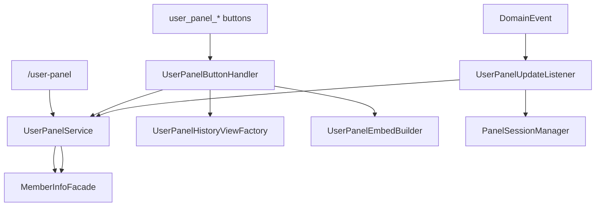

# Design: user-panel-java-parity

- Date: 2026-05-24
- Feature: user-panel-java-parity

## Traceability

| | |
| --- | --- |
| Requirement IDs | R1.1-R6.4 |
| In-scope modules | `packages/user-panel/` |
| Prerequisites | `user-panel-package-extraction` 完成 |
| Oracle | Java tests + preparation fixtures |

## Target vs baseline

| Aspect | TS baseline (admin) | Java target |
| ------ | ------------------- | ----------- |
| customId prefix | `user_history_*`, `user_redeem_*` | `user_panel_*` |
| Embed layout | flat description | mention + 2 inline fields |
| History builder | inline in handler | UserPanelHistoryViewFactory |
| Back button | missing | `user_panel_back` |
| Redeem button style | PRIMARY | SUCCESS |
| Service layer | direct facade | UserPanelService → MemberInfoFacade |

## Architecture alignment

## Java customId reference

| Constant | Value |
| -------- | ----- |
| BUTTON_CURRENCY_HISTORY | `user_panel_currency_history` |
| BUTTON_TOKEN_HISTORY | `user_panel_token_history` |
| BUTTON_PRODUCT_HISTORY | `user_panel_product_redemption_history` |
| BUTTON_CURRENCY_PAGE | `user_panel_currency_page_{n}` |
| BUTTON_TOKEN_PAGE | `user_panel_token_page_{n}` |
| BUTTON_PRODUCT_PAGE | `user_panel_product_redemption_page_{n}` |
| BUTTON_REDEEM | `user_panel_redeem` |
| BUTTON_BACK | `user_panel_back` |
| MODAL_REDEEM | `user_panel_modal_redeem` |

## Test strategy (drift checks)

| Test ID | Target unit | Oracle source |
| ------- | ----------- | ------------- |
| UT-201 | UserPanelEmbedBuilder.buildPanelEmbed | UserPanelEmbedBuilderTest.java |
| UT-202 | UserPanelEmbedBuilder.buildPanelComponents | UserPanelEmbedBuilderTest.java |
| UT-203 | UserPanelHistoryViewFactory.buildPaginationButtons | UserPanelHistoryViewFactoryTest.java |
| UT-204 | UserPanelConstants | java-custom-ids.json |
| UT-205 | UserPanelUpdateListener | UserPanelUpdateListenerTest.java |
| REG-201 | Redemption error messages | RedemptionService Java messages |

## Requirement linkage

| Req | Primary files |
| --- | ------------- |
| R1.x | `constants/UserPanelConstants.ts`, `handlers/UserPanelButtonHandler.ts` |
| R2.x-R3.x | `services/UserPanelEmbedBuilder.ts`, `commands/UserPanelCommand.ts` |
| R4.x | `services/UserPanelHistoryViewFactory.ts` |
| R5.x | `handlers/UserPanelButtonHandler.ts` (modal) |
| R6.x | `listeners/UserPanelUpdateListener.ts`, `session/PanelSessionManager.ts` |
