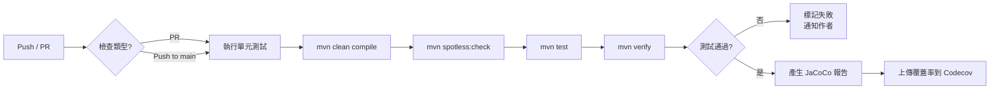
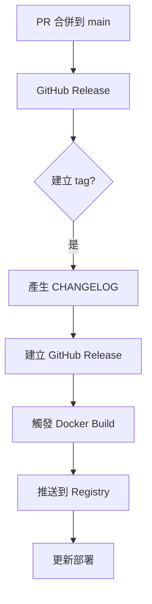

# 開發者工作流程指南

本文件說明 LTDJMS Discord Bot 的標準開發流程，包括測試驅動開發 (TDD)、OpenSpec 變更管理、提交規範與程式碼審查流程。遵循這些流程有助於維持程式碼品質與專案一致性。

## 開發環境設定

### 必要工具
- **Java 17+**：使用 SDKMAN 或官方發行版
- **Maven 3.8+**：建置與依賴管理
- **Docker & Docker Compose**：容器化開發環境
- **Git**：版本控制
- **IDE**：VS Code、IntelliJ IDEA 或 Eclipse（建議安裝 Java 擴充套件）

### 初始設定
```bash
# 克隆專案
git clone https://github.com/<username>/LTDJMS.git
cd LTDJMS

# 設定上游遠端（若為 fork）
git remote add upstream https://github.com/original-owner/LTDJMS.git

# 複製環境變數範本
cp .env.example .env
# 編輯 .env 填入 Discord Bot Token
```

### 驗證環境
```bash
# 執行測試確認環境正常
make test

# 啟動開發環境
make start-dev
```

## 測試驅動開發 (TDD) 流程

本專案嚴格遵循 TDD。所有新功能與錯誤修復都應從撰寫測試開始。

### TDD 三步驟

#### 1. 紅燈：先寫測試
為新功能或變更撰寫測試，描述預期行為。

**範例：新增餘額轉帳功能**
```java
@Test
void testTransferBalance_success() {
    // 準備測試資料
    long fromUserId = 1001L;
    long toUserId = 1002L;
    long guildId = 5001L;
    long amount = 500L;

    // 呼叫待實作方法
    Result<TransferResult, DomainError> result =
        balanceService.transferBalance(guildId, fromUserId, toUserId, amount);

    // 驗證預期結果
    assertThat(result.isOk()).isTrue();
    assertThat(result.unwrap().getFromNewBalance()).isEqualTo(500L);
    assertThat(result.unwrap().getToNewBalance()).isEqualTo(1500L);
}
```

#### 2. 綠燈：實作最簡單功能
撰寫最簡單的程式碼讓測試通過。

```java
public Result<TransferResult, DomainError> transferBalance(
    long guildId,
    long fromUserId,
    long toUserId,
    long amount
) {
    // 最簡單的實作：暫時回傳成功
    return Result.ok(new TransferResult(500L, 1500L));
}
```

#### 3. 重構：優化程式碼
在測試保持通過的情況下優化程式碼結構。

```java
public Result<TransferResult, DomainError> transferBalance(
    long guildId,
    long fromUserId,
    long toUserId,
    long amount
) {
    // 1. 驗證輸入
    if (amount <= 0) {
        return Result.err(DomainError.invalidInput("轉帳金額必須為正數"));
    }

    // 2. 檢查餘額
    Result<MemberCurrencyAccount, DomainError> fromAccount =
        accountRepository.findByGuildIdAndUserId(guildId, fromUserId);

    if (fromAccount.isErr()) {
        return Result.err(fromAccount.unwrapErr());
    }

    if (fromAccount.unwrap().getBalance() < amount) {
        return Result.err(DomainError.insufficientBalance());
    }

    // 3. 執行轉帳
    // ... 完整實作
}
```

### 測試執行指令

```bash
# 執行單元測試（快速回饋）
make test

# 執行所有測試（包含整合測試）
make test-integration

# 執行特定測試類別
mvn test -Dtest=BalanceServiceTest

# 產生覆蓋率報告
make coverage
```

### 測試覆蓋率要求
- **最低要求**：80% 行覆蓋率
- **檢查指令**：`make coverage-check`
- **排除項目**：Dagger 元件、JDBC 實作、Command Handlers 等基礎設施類別

## OpenSpec 變更管理流程

對於架構變更、重大功能新增或破壞性變更，必須使用 OpenSpec 流程。

### 何時使用 OpenSpec

| 變更類型 | 是否需要 OpenSpec |
|---------|------------------|
| 新增小功能（如新指令） | 否 |
| 錯誤修復 | 否 |
| 架構重構（如引入新框架） | 是 |
| 破壞性 API 變更 | 是 |
| 資料庫 schema 變更 | 是 |
| 新增核心模組 | 是 |

### OpenSpec 提案流程

#### 1. 建立提案目錄
```
openspec/changes/YYYY-MM-DD-feature-name/
├── proposal.md      # 提案文件
├── design.md        # 技術設計（可選）
├── specs/           # 詳細規格
└── tasks.md         # 實作任務清單
```

#### 2. 撰寫提案文件 (`proposal.md`)
```markdown
# 提案：新增貨幣轉帳功能

## 摘要
允許成員之間轉帳伺服器貨幣。

## 動機
- 促進社群經濟活動
- 減少管理員手動調整負擔

## 規格詳情
### 功能需求
1. 轉帳指令 `/transfer <成員> <金額>`
2. 餘額不足檢查
3. 轉帳紀錄查詢

### 技術設計
- 新增 `TransferService`
- 擴充 `CurrencyTransaction` 紀錄類型
- 更新資料庫 schema 新增索引

## 影響評估
### 破壞性變更
- 無

### 遷移需求
- 新增 `transaction_type` 欄位到 `currency_transaction` 表

## 替代方案考慮
1. 使用現有的調整指令搭配人工協調（棄用，效率低）
2. 實作拍賣系統（未來擴充）

## 決策記錄
同意實作，需補充足夠測試。
```

#### 3. 等待審核
- 提案提交至 GitHub Pull Request
- 至少需要一位維護者審核通過
- 必要時進行討論與修改

#### 4. 實作與驗證
- 根據核准的 `tasks.md` 實作功能
- 確保所有測試通過
- 更新相關文件

## Git 工作流程

### 分支策略
```
main (穩定版本)
├── feature/currency-transfer (功能分支)
├── fix/balance-calculation (錯誤修復分支)
└── release/v1.0.0 (發佈分支)
```

### 提交訊息規範
使用 [Conventional Commits](https://www.conventionalcommits.org/) 格式：

```
<類型>[可選範圍]: <描述>

[可選正文]

[可選頁尾]
```

**範例：**
```
feat(currency): 新增貨幣轉帳功能

- 新增 TransferService 處理轉帳邏輯
- 新增 /transfer 指令
- 新增轉帳交易紀錄類型

Closes #123
```

**常用類型：**
- `feat`：新功能
- `fix`：錯誤修復
- `docs`：文件更新
- `style`：程式碼風格調整
- `refactor`：重構
- `test`：測試相關
- `chore`：建置過程或工具變更

### 提交前檢查
```bash
# 執行測試
make test-integration

# 檢查程式碼風格
mvn spotless:check

# 檢查覆蓋率（本地）
make coverage-check
```

## 程式碼審查流程

### 建立 Pull Request
1. 推送功能分支到 GitHub
2. 建立 Pull Request 到 `main` 分支
3. 填寫 PR 模板：
   - 變更摘要
   - 相關議題編號
   - 測試計畫
   - 檢查清單

### 審查檢查清單
- [ ] 功能符合需求規格
- [ ] 測試覆蓋率足夠（新增測試）
- [ ] 遵循編碼風格規範
- [ ] 無安全疑慮
- [ ] 文件已更新（如有需要）
- [ ] 無破壞性變更（或已妥善處理）

### 審查意見處理
1. **接受意見**：直接修改並推送到同分支
2. **需要討論**：在 PR 評論中進一步討論
3. **不同意見**：提供技術依據，尋求共識

### 合併策略
- 使用 **squash merge** 保持歷史清晰
- 合併後刪除功能分支
- 同步 fork 到最新版本

## 本地開發工作流程

### 日常開發循環
```bash
# 1. 取得最新程式碼
git checkout main
git pull upstream main

# 2. 建立功能分支
git checkout -b feature/my-feature

# 3. 遵循 TDD 開發
#   撰寫測試 → 執行測試（失敗）→ 實作 → 執行測試（成功）→ 重構

# 4. 提交變更
git add .
git commit -m "feat(module): description"

# 5. 推送分支
git push origin feature/my-feature

# 6. 建立 Pull Request
```

### 重構工作流程
1. **確保測試覆蓋**：現有功能已有足夠測試
2. **小步重構**：每次只進行一項重構
3. **頻繁測試**：每次變更後執行測試
4. **保持功能不變**：只改變結構，不改變行為

### 錯誤修復流程
1. **重現錯誤**：撰寫測試重現錯誤情境
2. **分析原因**：使用除錯工具找出根本原因
3. **實作修復**：最小範圍的修復
4. **驗證修復**：確認原錯誤已解決，且未引入新問題
5. **補充測試**：新增測試防止錯誤回歸

## 工具與自動化

### 開發工具推薦
- **IDE**：VS Code 搭配 Java Extension Pack
- **除錯**：JDB、IDE 內建除錯器
- **效能分析**：VisualVM、JProfiler
- **API 測試**：Discord 開發者工具、cURL

### 自動化腳本
專案提供多個 Make 指令簡化開發：

```bash
# 開發環境
make dev          # 啟動開發環境（資料庫）
make test-watch   # 監控檔案變更並執行測試（需安裝 entr）

# 品質檢查
make lint         # 檢查程式碼風格
make audit        # 檢查相依套件漏洞

# 建置與部署
make package      # 建立可執行 JAR
make docker-build # 建置 Docker 映像
```

### CI/CD 整合

GitHub Actions 自動執行以下工作流程：

#### 1. CI Pipeline（持續整合）

| 工作流程 | 觸發條件 | 執行內容 |
|----------|----------|----------|
| `build.yml` | push / PR | Maven 建置、單元測試、程式碼風格檢查 |
| `integration-test.yml` | push / PR | 整合測試（使用 Testcontainers） |
| `security-scan.yml` | 每週 / PR | 相依套件漏洞掃描（Snyk/Dependabot） |

#### 2. CI Pipeline 流程圖



#### 3. 主要 GitHub Actions 工作流程

**`.github/workflows/build.yml`：**

```yaml
name: Build and Test

on:
  push:
    branches: [main]
  pull_request:
    branches: [main]

jobs:
  build:
    runs-on: ubuntu-latest
    steps:
      - uses: actions/checkout@v4
      - name: Set up Java 17
        uses: actions/setup-java@v4
        with:
          java-version: '17'
          distribution: 'temurin'
      - name: Cache Maven packages
        uses: actions/cache@v3
        with:
          path: ~/.m2
          key: ${{ runner.os }}-m2-${{ hashFiles('**/pom.xml') }}
      - name: Build with Maven
        run: mvn clean package -DskipTests
      - name: Run tests
        run: mvn test
      - name: Check code style
        run: mvn spotless:check
```

**`.github/workflows/integration-test.yml`：**

```yaml
name: Integration Tests

on:
  push:
    branches: [main]
  pull_request:

jobs:
  integration-test:
    runs-on: ubuntu-latest
    services:
      postgres:
        image: postgres:15
        env:
          POSTGRES_PASSWORD: postgres
        ports: 5432:5432
        options: >-
          --health-cmd pg_isready
          --health-interval 10s
          --health-timeout 5s
          --health-retries 5
    steps:
      - uses: actions/checkout@v4
      - name: Set up Java 17
        uses: actions/setup-java@v4
        with:
          java-version: '17'
      - name: Run integration tests
        run: mvn verify -Pintegration-test
        env:
          DB_URL: jdbc:postgresql://localhost:5432/currency_bot
          DB_USERNAME: postgres
          DB_PASSWORD: postgres
```

#### 4. CI 品質閘門

PR 必須通過以下檢查才能合併：

| 檢查 | 通過標準 | 說明 |
|------|----------|------|
| **單元測試** | 100% 通過 | `mvn test` |
| **整合測試** | 100% 通過 | `mvn verify -Pintegration-test` |
| **程式碼風格** | 無警告 | `mvn spotless:check` |
| **測試覆蓋率** | > 80% | JaCoCo 報告 |
| **安全性掃描** | 無高風險漏洞 | Dependabot |

#### 5. 發布流程



#### 6. 常見 CI 問題排除

| 問題 | 可能原因 | 解決方式 |
|------|----------|----------|
| Maven 依賴下載超時 | 網路問題 | 檢查 cache 或使用鏡像 |
| 測試失敗（本地通過） | 環境差異 | 確認 Java 版本與資料庫配置 |
| Spotless 格式化失敗 | 程式碼格式問題 | 執行 `mvn spotless:apply` |
| Testcontainers 失敗 | Docker 權限問題 | 確認 Docker daemon 執行中 |

---

## 最佳實踐

### 程式碼品質
1. **單一職責原則**：每個類別/方法只做一件事
2. **依賴注入**：使用 Dagger 管理依賴，提高可測試性
3. **不可變物件**：領域模型盡可能設計為不可變
4. **錯誤處理**：使用 `Result<T, DomainError>` 處理預期錯誤

### 測試策略
1. **單元測試優先**：測試單一類別/方法
2. **整合測試補充**：測試跨元件互動
3. **契約測試**：確保對外介面穩定性
4. **效能測試**：監控關鍵路徑效能

### 文件維護
1. **程式碼即文件**：有意義的命名與清晰結構
2. **及時更新**：功能變更時同步更新文件
3. **多層次文件**：從快速入門到詳細規格
4. **範例驅動**：提供可運行的程式碼範例

## 問題解決與支援

### 遇到問題時
1. **檢查日誌**：`make logs` 或查看應用程式日誌
2. **執行測試**：確認是否為環境問題
3. **查閱文件**：相關模組說明與 API 文件
4. **搜尋議題**：查看是否有類似問題已解決

### 尋求協助
- **GitHub Issues**：報告錯誤或提出問題
- **Pull Request**：提出解決方案
- **討論區**（如有）：進行設計討論

### 學習資源
- [Discord 開發者文件](https://discord.com/developers/docs/intro)
- [JDA 文件](https://ci.dv8tion.net/job/JDA5/javadoc/)
- [Dagger 2 指南](https://dagger.dev/dev-guide/)
- [Flyway 文件](https://flywaydb.org/documentation/)

---

遵循這些工作流程能確保你的貢獻順利整合到專案中，同時維持專案的品質與穩定性。如有疑問，請隨時提出討論。