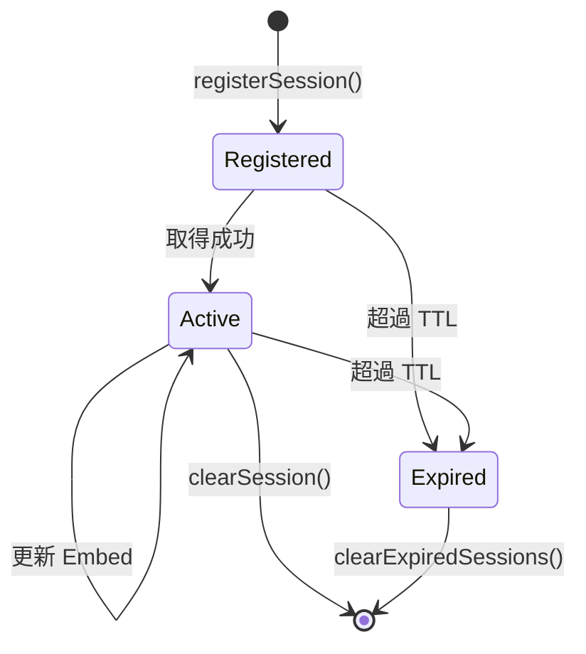
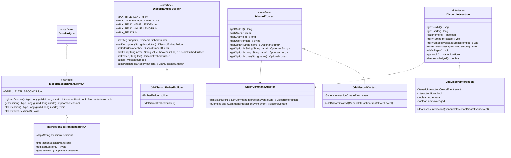
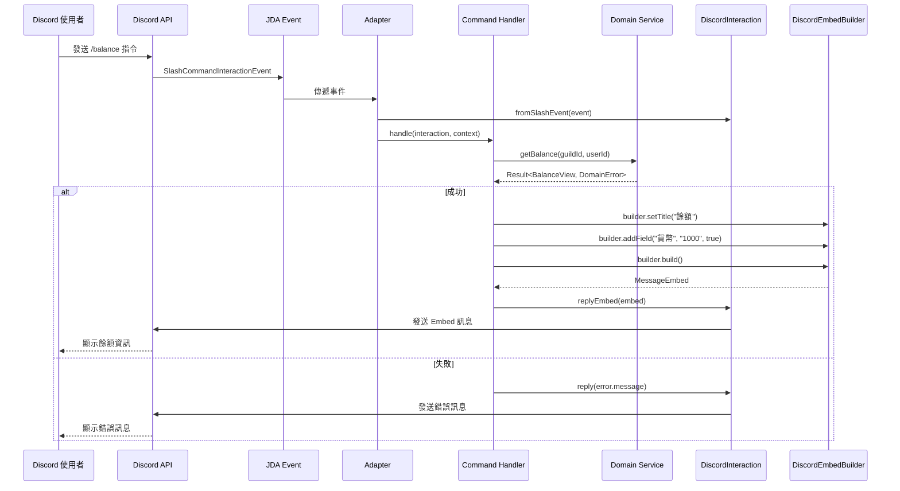

# Discord API 抽象層

## 概述

Discord API 抽象層（`discord` 模組）是 LTDJMS 系統中用於解除與 JDA（Java Discord API）強耦合的基礎設施層。此模組提供統一的介面來處理 Discord 互動，使業務邏輯與特定的 Discord 函式庫實作分離，從而提升可測試性與可維護性。

### 設計目標

1. **解除 JDA 耦合**：業務邏輯不直接依賴 JDA 類別，透過抽象介面互動
2. **提升可測試性**：提供 Mock 實作，便於在不啟動 Discord Bot 的情況下進行單元測試
3. **統一介面**：標準化 Discord 互動操作（回應、編輯、Context 提取、Embed 建構）
4. **簡化遷移**：未來如需更換 Discord 函式庫，只需更換實作層

### 模組位置

```
src/main/java/ltdjms/discord/discord/
├── adapter/        # JDA Event 到抽象介面的轉接器
├── domain/         # 抽象介面定義
├── mock/           # 測試用 Mock 實作
└── services/       # JDA 實作
```

---

## 核心抽象

### 1. DiscordInteraction

**目的**：統一的 Discord 互動回應介面。

**職責**：
- 發送訊息回應（純文字、Embed）
- 編輯現有訊息
- 延遲回應（defer reply）
- 提取 Guild ID 與使用者 ID
- 追蹤互動狀態（是否已確認）

**介面定義**：

```java
public interface DiscordInteraction {
    long getGuildId();
    long getUserId();
    boolean isEphemeral();

    void reply(String message);
    void replyEmbed(MessageEmbed embed);
    void editEmbed(MessageEmbed embed);
    void deferReply();

    InteractionHook getHook();
    boolean isAcknowledged();
}
```

**使用場景**：
- Command Handler 回應使用者指令
- Button Handler 更新面板訊息
- Modal Handler 提交表單後的回應

---

### 2. DiscordContext

**目的**：從 Discord 事件中提取上下文資訊的統一介面。

**職責**：
- 取得 Guild、使用者、頻道 ID
- 取得使用者 Mention 格式
- 提取命令參數（options）並自動轉型

**介面定義**：

```java
public interface DiscordContext {
    long getGuildId();
    long getUserId();
    long getChannelId();
    String getUserMention();

    Optional<String> getOption(String name);
    Optional<String> getOptionAsString(String name);
    Optional<Long> getOptionAsLong(String name);
    Optional<User> getOptionAsUser(String name);
}
```

**使用場景**：
- 從 Slash 指令中提取參數
- 統一取得使用者資訊
- 簡化命令參數解析邏輯

---

### 3. DiscordEmbedBuilder

**目的**：Discord Embed 建構器抽象介面，自動處理 Discord API 長度限制。

**職責**：
- 流式 API 建構 Embed
- 自動截斷超長內容
- 支援分頁 Embed

**Discord API 長度限制**：

| 欄位 | 限制 |
|------|------|
| Title | 256 字元 |
| Description | 4096 字元 |
| Field Name | 256 字元 |
| Field Value | 1024 字元 |
| Fields | 25 個 |
| Footer | 2048 字元 |

**介面定義**：

```java
public interface DiscordEmbedBuilder {
    DiscordEmbedBuilder setTitle(String title);
    DiscordEmbedBuilder setDescription(String description);
    DiscordEmbedBuilder setColor(Color color);
    DiscordEmbedBuilder addField(String name, String value, boolean inline);
    DiscordEmbedBuilder setFooter(String text);

    MessageEmbed build();
    List<MessageEmbed> buildPaginated(EmbedView data);
}
```

**使用範例**：

```java
DiscordEmbedBuilder builder = discordEmbedBuilder;
MessageEmbed embed = builder
    .setTitle("使用者餘額")
    .setDescription("以下是您的餘額資訊")
    .setColor(new Color(0x5865F2))
    .addField("貨幣餘額", "1,000", true)
    .addField("代幣餘額", "500", true)
    .setFooter("由 LTDJMS 提供")
    .build();
```

---

### 4. DiscordSessionManager

**目的**：管理跨多次互動的 Session 狀態（如使用者面板）。

**職責**：
- 註冊、檢索、清除 Session
- 自動過濾過期 Session（基於 TTL）
- 支援泛型 Session 類型

**介面定義**：

```java
public interface DiscordSessionManager<K extends Enum<K> & SessionType> {
    long DEFAULT_TTL_SECONDS = 15 * 60; // 15 分鐘

    void registerSession(K type, long guildId, long userId,
                        InteractionHook hook, Map<String, Object> metadata);

    Optional<Session<K>> getSession(K type, long guildId, long userId);
    void clearSession(K type, long guildId, long userId);
    void clearExpiredSessions();

    record Session<K>(
        K type,
        InteractionHook hook,
        Instant createdAt,
        long ttlSeconds,
        Map<String, Object> metadata
    ) {
        boolean isExpired();
        long getRemainingSeconds();
    }
}
```

**Session 生命週期**：



**使用場景**：
- 使用者面板的分頁狀態管理
- 管理面板的編輯狀態追蹤
- 購物車的臨時狀態儲存

---

## 實作層

### JDA 實作

| 介面 | JDA 實作 | 說明 |
|------|----------|------|
| `DiscordInteraction` | `JdaDiscordInteraction` | 包裝 `GenericInteractionCreateEvent` |
| `DiscordContext` | `JdaDiscordContext` | 從 JDA 事件提取上下文 |
| `DiscordEmbedBuilder` | `JdaDiscordEmbedBuilder` | 使用 `EmbedBuilder` 建構 Embed |
| `DiscordSessionManager` | `InteractionSessionManager` | 基於 `InteractionHook` 的 Session 管理 |

### Mock 實作

| 介面 | Mock 實作 | 用途 |
|------|----------|------|
| `DiscordInteraction` | `MockDiscordInteraction` | 單元測試時模擬互動回應 |
| `DiscordContext` | `MockDiscordContext` | 單元測試時模擬上下文 |
| `DiscordEmbedBuilder` | `MockDiscordEmbedBuilder` | 單元測試時驗證 Embed 建構 |

### Adapter 轉接器

Adapter 層提供靜態方法將 JDA 事件轉換為抽象介面：

```java
// SlashCommandAdapter
DiscordInteraction interaction = SlashCommandAdapter.fromSlashEvent(event);
DiscordContext context = SlashCommandAdapter.toContext(event);

// ButtonInteractionAdapter
DiscordInteraction interaction = ButtonInteractionAdapter.fromButtonEvent(event);
DiscordContext context = ButtonInteractionAdapter.toContext(event);

// ModalInteractionAdapter
DiscordInteraction interaction = ModalInteractionAdapter.fromModalEvent(event);
DiscordContext context = ModalInteractionAdapter.toContext(event);
```

---

## 類別圖



---

## 時序圖：典型請求流程



---

## 使用範例

### Command Handler 整合

**傳統方式（直接使用 JDA）**：

```java
public class BalanceCommandHandler {
    public void handle(SlashCommandInteractionEvent event) {
        long guildId = event.getGuild().getIdLong();
        long userId = event.getUser().getIdLong();

        Result<BalanceView, DomainError> result =
            balanceService.getBalance(guildId, userId);

        if (result.isOk()) {
            EmbedBuilder builder = new EmbedBuilder();
            builder.setTitle("餘額");
            builder.addField("貨幣", result.getValue().currency(), true);
            event.replyEmbeds(builder.build()).queue();
        }
    }
}
```

**使用抽象層**：

```java
public class BalanceCommandHandler {
    private final DiscordEmbedBuilder embedBuilder;

    public void handle(SlashCommandInteractionEvent event) {
        DiscordInteraction interaction = SlashCommandAdapter.fromSlashEvent(event);
        DiscordContext context = SlashCommandAdapter.toContext(event);

        Result<BalanceView, DomainError> result =
            balanceService.getBalance(context.getGuildId(), context.getUserId());

        if (result.isOk()) {
            MessageEmbed embed = embedBuilder
                .setTitle("餘額")
                .addField("貨幣", result.getValue().currency(), true)
                .build();

            interaction.replyEmbed(embed);
        }
    }
}
```

---

### 單元測試範例

**使用 Mock 實作**：

```java
@Test
void testBalanceCommand_withSufficientBalance_returnsEmbed() {
    // Arrange
    MockDiscordInteraction mockInteraction = new MockDiscordInteraction(123L, 456L);
    MockDiscordContext mockContext = new MockDiscordContext(123L, 456L, 789L);
    MockDiscordEmbedBuilder mockBuilder = new MockDiscordEmbedBuilder();

    BalanceService balanceService = mock(BalanceService.class);
    when(balanceService.getBalance(123L, 456L))
        .thenReturn(Result.ok(new BalanceView("1000", "500")));

    BalanceCommandHandler handler = new BalanceCommandHandler(
        balanceService, mockBuilder
    );

    // Act
    handler.handleInternal(mockInteraction, mockContext);

    // Assert
    assertTrue(mockInteraction.isReplied());
    assertEquals(1, mockBuilder.getBuildCount());
    verify(balanceService).getBalance(123L, 456L);
}
```

**使用 JDA 實作（整合測試）**：

```java
@Test
void testBalanceCommand_withJdaIntegration() {
    // 需要使用 DiscordJDA 整合測試框架或 Mock JDA 事件
    SlashCommandInteractionEvent mockEvent = mock(SlashCommandInteractionEvent.class);
    when(mockEvent.getGuild()).thenReturn(mockGuild);
    when(mockEvent.getUser()).thenReturn(mockUser);

    DiscordInteraction interaction = SlashCommandAdapter.fromSlashEvent(mockEvent);

    // 驗證行為...
}
```

---

## 依賴注入配置

Discord 抽象層的元件透過 `DiscordModule` 註冊到 Dagger 2 容器：

```java
@Module
public class DiscordModule {

    @Provides
    @Singleton
    public DiscordEmbedBuilder provideDiscordEmbedBuilder() {
        return new JdaDiscordEmbedBuilder();
    }

    // 注意：DiscordInteraction 和 DiscordContext 目前透過 Adapter 直接建立
    // 未來可考慮將它們也納入 DI 容器管理
}
```

**在 AppComponent 中使用**：

```java
@Component(modules = {DiscordModule.class, /* 其他模組 */})
public interface AppComponent {
    DiscordEmbedBuilder discordEmbedBuilder();

    // 其他服務...
}
```

---

## DiscordError

Discord API 特定的錯誤類型，與現有的 `DomainError` 系統整合：

```java
public record DiscordError(Category category, String message, Throwable cause) {
    public enum Category {
        INTERACTION_TIMEOUT,  // 3 秒內未回應
        HOOK_EXPIRED,         // Hook 超過 15 分鐘
        UNKNOWN_MESSAGE,      // 訊息已刪除或無法存取
        RATE_LIMITED,         // 超過 Rate Limit
        MISSING_PERMISSIONS,  // 缺少必要權限
        INVALID_COMPONENT_ID  // 無效的 Component ID
    }
}
```

**使用範例**：

```java
public Result<Void, DiscordError> updatePanel(Session session, MessageEmbed embed) {
    try {
        session.hook().editOriginalEmbeds(embed).queue();
        return Result.ok();
    } catch (ErrorResponseException e) {
        if (e.getErrorResponse() == ErrorResponse.UNKNOWN_MESSAGE) {
            return Result.err(DiscordError.unknownMessage(session.id()));
        }
        return Result.err(DiscordError.hookExpired());
    }
}
```

---

## 設計決策

### 為何使用介面抽象？

1. **可測試性**：Mock 實作允許在不啟動 Discord Bot 的情況下測試業務邏輯
2. **可維護性**：更換 Discord 函式庫只需更換實作層，業務邏輯不變
3. **簡化測試**：不需要 Mock 複雜的 JDA 事件物件

### 為何 TTL 為 15 分鐘？

Discord API 規定 `InteractionHook` 在 15 分鐘後失效，因此 Session 的預設 TTL 設為 15 分鐘以確保一致性。

### 為何使用泛型 SessionType？

泛型設計允許各模組定義自己的 Session 類型，避免類型衝突：

```java
// Currency 模組
public enum CurrencySessionType implements SessionType {
    TRANSFER_CONFIRMATION
}

// Panel 模組
public enum PanelSessionType implements SessionType {
    USER_PANEL,
    ADMIN_PANEL
}

// Shop 模組
public enum ShopSessionType implements SessionType {
    PURCHASE_CONFIRMATION
}
```

---

## 檔案結構

```
src/main/java/ltdjms/discord/discord/
├── adapter/
│   ├── ButtonInteractionAdapter.java
│   ├── ModalInteractionAdapter.java
│   └── SlashCommandAdapter.java
├── domain/
│   ├── ButtonView.java
│   ├── DiscordButtonEvent.java
│   ├── DiscordContext.java
│   ├── DiscordEmbedBuilder.java
│   ├── DiscordError.java
│   ├── DiscordInteraction.java
│   ├── DiscordModalEvent.java
│   ├── DiscordSessionManager.java
│   ├── EmbedView.java
│   └── SessionType.java
├── mock/
│   ├── MockDiscordContext.java
│   ├── MockDiscordEmbedBuilder.java
│   └── MockDiscordInteraction.java
└── services/
    ├── InteractionSessionManager.java
    ├── JdaDiscordContext.java
    ├── JdaDiscordEmbedBuilder.java
    └── JdaDiscordInteraction.java

src/test/java/ltdjms/discord/discord/
├── adapter/
│   ├── ButtonInteractionAdapterTest.java
│   ├── ModalInteractionAdapterTest.java
│   └── SlashCommandAdapterTest.java
├── domain/
│   ├── ButtonViewTest.java
│   ├── DiscordContextTest.java
│   ├── DiscordEmbedBuilderTest.java
│   ├── DiscordErrorTest.java
│   ├── DiscordInteractionTest.java
│   └── DiscordSessionManagerTest.java
├── mock/
│   ├── MockDiscordContextTest.java
│   ├── MockDiscordEmbedBuilderTest.java
│   └── MockDiscordInteractionTest.java
└── services/
    ├── InteractionSessionManagerTest.java
    ├── JdaDiscordContextTest.java
    ├── JdaDiscordEmbedBuilderTest.java
    └── JdaDiscordInteractionTest.java
```

---

## 相關文件

- [系統架構總覽](../architecture/overview.md)
- [Shared 模組](shared-module.md)
- [測試策略](../development/testing.md)
- [Event 系統](event-system.md)
