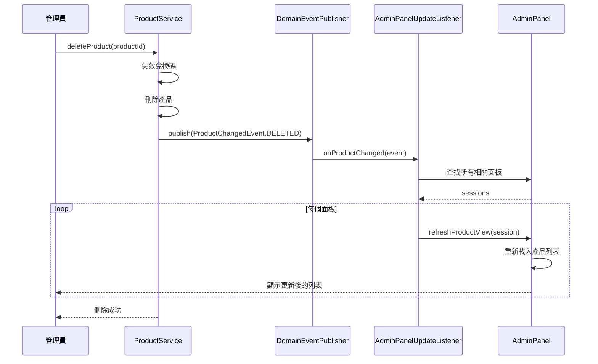
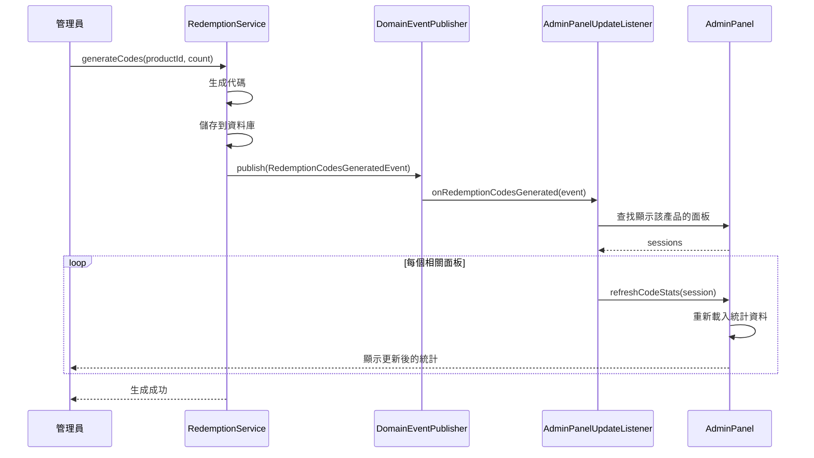
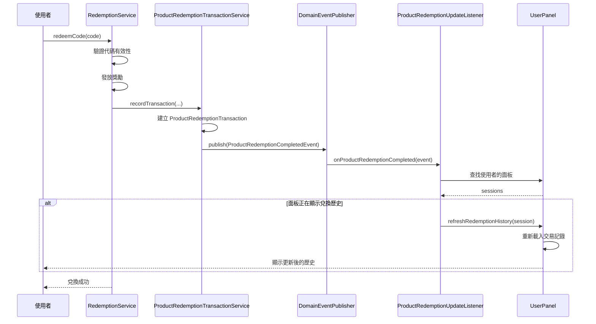

# 事件系統設計與實作

本文件說明 LTDJMS Discord Bot 的領域事件系統，負責在系統內不同模組之間傳遞狀態變更通知，實現鬆耦合的架構設計。

## 1. 概述

事件系統採用 **領域事件模式**（Domain Events），當重要的業務狀態發生變更時，系統會發布對應的事件通知。其他模組可以訂閱這些事件並做出相應的反應，而無需直接依賴發布方。

主要優勢：
- **鬆耦合**：模組之間不需要直接依賴
- **可擴充**：新增訂閱者不需修改發布方
- **一致性**：所有訂閱者收到相同的狀態變更通知
- **可測試**：事件發布與訂閱可以分開測試

## 2. 事件架構

### 2.1 事件類型層次

```java
// 領域事件基底介面
public interface DomainEvent {
    /**
     * 事件發生的時間戳
     */
    Instant occurredAt();

    /**
     * 事件類型識別碼
     */
    String eventType();
}
```

### 2.2 事件總覽

| 事件類型 | 發布時機 | 訂閱者 | 用途 |
|---------|---------|--------|------|
| `ProductChangedEvent` | 產品建立、更新、刪除 | `AdminPanelUpdateListener` | 通知管理員面板刷新產品列表 |
| `RedemptionCodesGeneratedEvent` | 兌換碼批量生成 | `AdminPanelUpdateListener` | 通知管理員面板更新代碼統計 |
| `ProductRedemptionCompletedEvent` | V008 新增：商品兌換完成 | `ProductRedemptionUpdateListener` | 通知使用者面板刷新兌換歷史 |

## 3. 事件定義

### 3.1 ProductChangedEvent

當產品狀態發生變更時發布。

```java
// src/main/java/ltdjms/discord/shared/events/ProductChangedEvent.java
public record ProductChangedEvent(
    long guildId,           // Discord 伺服器 ID
    Long productId,         // 產品 ID（刪除後可能為 null）
    OperationType operation, // 操作類型
    Instant occurredAt       // 發生時間
) implements DomainEvent {

    public enum OperationType {
        CREATED,   // 產品建立
        UPDATED,   // 產品更新
        DELETED    // 產品刪除
    }

    public ProductChangedEvent {
        if (occurredAt == null) {
            occurredAt = Instant.now();
        }
    }

    @Override
    public Instant occurredAt() {
        return occurredAt;
    }

    @Override
    public String eventType() {
        return "ProductChanged";
    }

    /**
     * 建立產品建立事件
     */
    public static ProductChangedEvent created(long guildId, Long productId) {
        return new ProductChangedEvent(guildId, productId, OperationType.CREATED, Instant.now());
    }

    /**
     * 建立產品更新事件
     */
    public static ProductChangedEvent updated(long guildId, Long productId) {
        return new ProductChangedEvent(guildId, productId, OperationType.UPDATED, Instant.now());
    }

    /**
     * 建立產品刪除事件
     */
    public static ProductChangedEvent deleted(long guildId, Long productId) {
        return new ProductChangedEvent(guildId, productId, OperationType.DELETED, Instant.now());
    }
}
```

**發布位置**：
- `ProductService.createProduct()`: 建立產品後
- `ProductService.updateProduct()`: 更新產品後
- `ProductService.deleteProduct()`: 刪除產品後

### 3.2 RedemptionCodesGeneratedEvent

當兌換碼批量生成時發布。

```java
// src/main/java/ltdjms/discord/shared/events/RedemptionCodesGeneratedEvent.java
public record RedemptionCodesGeneratedEvent(
    long guildId,       // Discord 伺服器 ID
    Long productId,     // 產品 ID
    int count,          // 生成的代碼數量
    Instant occurredAt  // 發生時間
) implements DomainEvent {

    public RedemptionCodesGeneratedEvent {
        if (occurredAt == null) {
            occurredAt = Instant.now();
        }
    }

    @Override
    public Instant occurredAt() {
        return occurredAt;
    }

    @Override
    public String eventType() {
        return "RedemptionCodesGenerated";
    }

    /**
     * 建立代碼生成事件
     */
    public static RedemptionCodesGeneratedEvent of(long guildId, Long productId, int count) {
        return new RedemptionCodesGeneratedEvent(guildId, productId, count, Instant.now());
    }
}
```

**發布位置**：
- `RedemptionService.generateCodes()`: 批次生成兌換碼後

### 3.3 ProductRedemptionCompletedEvent（V008 新增）

當商品兌換完成時發布。

```java
// src/main/java/ltdjms/discord/shared/events/ProductRedemptionCompletedEvent.java
public record ProductRedemptionCompletedEvent(
    long guildId,                        // Discord 伺服器 ID
    long userId,                         // 使用者 ID
    ProductRedemptionTransaction transaction,  // 商品兌換交易記錄
    Instant timestamp                    // 發生時間
) implements DomainEvent {

    public ProductRedemptionCompletedEvent {
        if (timestamp == null) {
            timestamp = Instant.now();
        }
    }

    @Override
    public Instant occurredAt() {
        return timestamp;
    }

    @Override
    public String eventType() {
        return "ProductRedemptionCompleted";
    }

    /**
     * 取得交易記錄中的產品名稱
     */
    public String getProductName() {
        return transaction.productName();
    }

    /**
     * 取得獎勵資訊字串
     */
    public String getRewardInfo() {
        return transaction.formatForDisplay();
    }
}
```

**發布位置**：
- `ProductRedemptionTransactionService.recordTransaction()`: 記錄兌換交易後

**用途**：
- 通知 `ProductRedemptionUpdateListener` 刷新使用者面板的兌換歷史顯示
- 確保使用者即時看到自己的最新兌換記錄

## 4. 事件發布器

### 4.1 DomainEventPublisher 介面

```java
// src/main/java/ltdjms/discord/shared/events/DomainEventPublisher.java
public interface DomainEventPublisher {
    /**
     * 發布領域事件
     * @param event 事件物件
     */
    void publish(DomainEvent event);

    /**
     * 註冊事件訂閱者
     * @param subscriber 訂閱者物件
     */
    void register(Object subscriber);

    /**
     * 移除事件訂閱者
     * @param subscriber 訂閱者物件
     */
    void unregister(Object subscriber);
}
```

### 4.2 實作方式

LTDJMS 使用簡單的同步事件發布機制：

```java
// src/main/java/ltdjms/discord/shared/events/SyncDomainEventPublisher.java
public class SyncDomainEventPublisher implements DomainEventPublisher {
    private final List<Object> subscribers = new CopyOnWriteArrayList<>();

    @Override
    public void publish(DomainEvent event) {
        for (Object subscriber : subscribers) {
            try {
                // 使用反射呼叫訂閱者的方法
                handleEvent(subscriber, event);
            } catch (Exception e) {
                LOG.error("Failed to deliver event to subscriber: " + subscriber, e);
            }
        }
    }

    private void handleEvent(Object subscriber, DomainEvent event) {
        // 根據事件類型呼叫對應的方法
        if (event instanceof ProductChangedEvent e && subscriber instanceof ProductChangedListener listener) {
            listener.onProductChanged(e);
        } else if (event instanceof RedemptionCodesGeneratedEvent e && subscriber instanceof RedemptionCodesGeneratedListener listener) {
            listener.onRedemptionCodesGenerated(e);
        }
    }

    @Override
    public void register(Object subscriber) {
        subscribers.add(subscriber);
    }

    @Override
    public void unregister(Object subscriber) {
        subscribers.remove(subscriber);
    }
}
```

## 5. 事件訂閱者

### 5.1 訂閱者介面

```java
// 產品變更監聽器
public interface ProductChangedListener {
    void onProductChanged(ProductChangedEvent event);
}

// 兌換碼生成監聽器
public interface RedemptionCodesGeneratedListener {
    void onRedemptionCodesGenerated(RedemptionCodesGeneratedEvent event);
}

// V008 新增：商品兌換完成監聽器
public interface ProductRedemptionCompletedListener {
    void onProductRedemptionCompleted(ProductRedemptionCompletedEvent event);
}
```

### 5.2 AdminPanelUpdateListener

管理員面板更新監聽器，負責即時刷新面板顯示。

```java
// src/main/java/ltdjms/discord/panel/services/AdminPanelUpdateListener.java
public class AdminPanelUpdateListener
    implements ProductChangedListener, RedemptionCodesGeneratedListener {

    private final AdminPanelService adminPanelService;

    @Override
    public void onProductChanged(ProductChangedEvent event) {
        LOG.info("Received ProductChangedEvent: guildId={}, productId={}, operation={}",
            event.guildId(), event.productId(), event.operation());

        // 查找所有顯示該產品資訊的面板
        List<AdminPanelSession> sessions = adminPanelService.findSessionsByGuild(event.guildId());

        for (AdminPanelSession session : sessions) {
            try {
                // 刷新面板顯示
                adminPanelService.refreshProductView(session);
            } catch (Exception e) {
                LOG.error("Failed to refresh admin panel for session: " + session.id(), e);
            }
        }
    }

    @Override
    public void onRedemptionCodesGenerated(RedemptionCodesGeneratedEvent event) {
        LOG.info("Received RedemptionCodesGeneratedEvent: guildId={}, productId={}, count={}",
            event.guildId(), event.productId(), event.count());

        // 更新代碼統計顯示
        List<AdminPanelSession> sessions = adminPanelService.findSessionsByGuild(event.guildId());

        for (AdminPanelSession session : sessions) {
            if (session.currentProductId().equals(event.productId())) {
                try {
                    adminPanelService.refreshCodeStats(session);
                } catch (Exception e) {
                    LOG.error("Failed to refresh code stats for session: " + session.id(), e);
                }
            }
        }
    }
}
```

### 5.3 ProductRedemptionUpdateListener（V008 新增）

商品兌換完成監聽器，負責即時更新使用者面板的兌換歷史顯示。

```java
// src/main/java/ltdjms/discord/panel/services/ProductRedemptionUpdateListener.java
public class ProductRedemptionUpdateListener
    implements ProductRedemptionCompletedListener {

    private final UserPanelService userPanelService;

    @Override
    public void onProductRedemptionCompleted(ProductRedemptionCompletedEvent event) {
        LOG.info("Received ProductRedemptionCompletedEvent: guildId={}, userId={}, product={}",
            event.guildId(), event.userId(), event.getProductName());

        // 查找該使用者所有開啟的面板
        List<UserPanelSession> sessions = userPanelService.findSessionsByUser(
            event.guildId(), event.userId()
        );

        for (UserPanelSession session : sessions) {
            try {
                // 如果面板正在顯示兌換歷史，刷新顯示
                if (session.currentView() == UserPanelView.Type.REDEMPTION_HISTORY) {
                    userPanelService.refreshRedemptionHistory(session);
                }
            } catch (Exception e) {
                LOG.error("Failed to refresh user panel for session: " + session.id(), e);
            }
        }
    }
}
```

**設計特點**：
- 只刷新正在顯示兌換歷史的面板，避免不必要的更新
- 使用者可立即看到自己的最新兌換記錄
- 刷新失敗不會影響兌換流程本身

## 6. 依賴注入設定

```java
// src/main/java/ltdjms/discord/shared/di/EventModule.java
@Module
public class EventModule {
    @Provides
    @Singleton
    public DomainEventPublisher provideDomainEventPublisher() {
        return new SyncDomainEventPublisher();
    }

    @Provides
    @Singleton
    public AdminPanelUpdateListener provideAdminPanelUpdateListener(
        DomainEventPublisher eventPublisher,
        AdminPanelService adminPanelService) {

        AdminPanelUpdateListener listener = new AdminPanelUpdateListener(adminPanelService);
        eventPublisher.register(listener);
        return listener;
    }
}
```

## 7. 事件流程範例

### 7.1 產品刪除事件流程



### 7.2 兌換碼生成事件流程



### 7.3 商品兌換完成事件流程（V008 新增）



## 8. 錯誤處理

事件發布與訂閱的錯誤處理策略：

### 8.1 發布方錯誤處理

```java
// Service 層的錯誤處理
public Result<Product, DomainError> createProduct(...) {
    try {
        // 執行業務邏輯
        Product saved = productRepository.save(product);

        // 事件發布失敗不影響主流程
        try {
            eventPublisher.publish(ProductChangedEvent.created(guildId, saved.id()));
        } catch (Exception e) {
            LOG.error("Failed to publish ProductChangedEvent", e);
        }

        return Result.ok(saved);
    } catch (Exception e) {
        return Result.err(DomainError.persistenceFailure("建立商品失敗", e));
    }
}
```

**設計原則**：
- 事件發布失敗**不影響**主業務流程
- 錯誤記錄到日誌供後續排查
- 訂閱者內部的錯誤不會影響其他訂閱者

### 8.2 訂閱者錯誤處理

```java
// SyncDomainEventPublisher 的錯誤處理
@Override
public void publish(DomainEvent event) {
    for (Object subscriber : subscribers) {
        try {
            handleEvent(subscriber, event);
        } catch (Exception e) {
            // 記錄錯誤但繼續處理其他訂閱者
            LOG.error("Failed to deliver event {} to subscriber: {}", event.eventType(), subscriber, e);
        }
    }
}
```

## 9. 測試策略

### 9.1 單元測試：事件發布

```java
@Test
void createProduct_shouldPublishEvent() {
    // Arrange
    DomainEventPublisher mockPublisher = mock(DomainEventPublisher.class);
    ProductService service = new ProductService(repository, redemptionRepo, mockPublisher);

    // Act
    service.createProduct(guildId, name, description, rewardType, rewardAmount);

    // Assert
    verify(mockPublisher).publish(argThat(event ->
        event instanceof ProductChangedEvent &&
        ((ProductChangedEvent) event).operation() == OperationType.CREATED
    ));
}
```

### 9.2 整合測試：事件訂閱

```java
@Test
void generateCodes_shouldTriggerPanelRefresh() {
    // Arrange
    TestListener listener = new TestListener();
    eventPublisher.register(listener);
    AdminPanelSession session = createTestSession();

    // Act
    redemptionService.generateCodes(productId, 10, null);

    // Assert
    assertThat(listener.receivedEvents).hasSize(1);
    assertThat(listener.receivedEvents.get(0).count()).isEqualTo(10);
}
```

## 10. 未來擴充方向

### 10.1 非同步事件發布

當前使用同步發布，未來可考慮：

- 使用訊息佇列（如 RabbitMQ、Kafka）實現非同步發布
- 支援事件重播與持久化
- 提高系統吞吐量

### 10.2 事件溯源（Event Sourcing）

可考慮將事件作為主要資料來源：

- 所有狀態變更都記錄為事件
- 從事件串流重建當前狀態
- 提供完整的審計追蹤

### 10.3 跨服務事件

若系統拆分為微服務：

- 使用事件匯流排進行服務間通訊
- 支援事件轉換與協議轉接
- 實現最終一致性

---

事件系統為 LTDJMS 提供了鬆耦合的模組間通訊機制，使得系統更容易維護和擴充。開發者在新增功能時，應考慮是否需要發布相關的領域事件，以保持系統的一致性。
