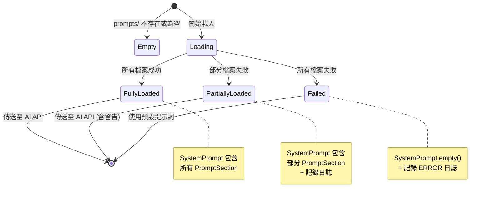

# Data Model: External Prompts Loader

**Feature**: External Prompts Loader
**Branch**: `004-external-prompts-loader`
**Date**: 2025-12-28

## Overview

本文檔定義了外部提示詞載入功能的領域模型。模型設計遵循 DDD 原則，使用 Java 17 的 `record` 類型實現不可變的資料結構。

---

## Core Entities

### 1. PromptSection

代表從單一 markdown 檔案生成的提示詞區間，包含標題和內容。

```java
package ltdjms.discord.aichat.domain;

/**
 * 提示詞區間，代表單一檔案的內容與其對應的標題。
 *
 * @param title 區間標題（檔案名稱轉換後的大寫格式，如 "BOT PERSONALITY"）
 * @param content 檔案的 markdown 內容
 */
public record PromptSection(String title, String content) {

  /** 建立空的提示詞區間（用於錯誤處理）。 */
  public static PromptSection empty() {
    return new PromptSection("", "");
  }

  /** 檢查區間是否為空。 */
  public boolean isEmpty() {
    return title.isBlank() && content.isBlank();
  }

  /** 檢查內容是否為空。 */
  public boolean isContentEmpty() {
    return content.isBlank();
  }

  /**
   * 格式化為分隔線 + 標題 + 內容的字串。
   *
   * <p>格式範例：
   *
   * <pre>
   * === BOT PERSONALITY ===
   * 這是機器人的人格描述...
   * </pre>
   */
  public String toFormattedString() {
    if (isEmpty()) {
      return "";
    }
    return String.format("=== %s ===%n%s", title, content);
  }
}
```

**欄位說明**：
- `title`: 標準化後的區間標題（大寫、空格分隔）
- `content`: 原始 markdown 內容（保留格式）

**驗證規則**：
- `title` 不可為 `null`（可為空字串）
- `content` 不可為 `null`（可為空字串）

---

### 2. SystemPrompt

代表完整的系統提示詞，由多個 `PromptSection` 組成。

```java
package ltdjms.discord.aichat.domain;

import java.util.ArrayList;
import java.util.Collections;
import java.util.List;
import java.util.Objects;

/**
 * 系統提示詞，由多個提示詞區間組成的完整內容。
 *
 * <p>此物件用於合併多個 markdown 檔案的內容，生成單一的 system prompt 字串。
 *
 * @param sections 提示詞區間列表（按字母順序排列）
 */
public record SystemPrompt(List<PromptSection> sections) {

  /** 建立空的系統提示詞。 */
  public static SystemPrompt empty() {
    return new SystemPrompt(List.of());
  }

  /** 建立包含單一區間的系統提示詞。 */
  public static SystemPrompt of(PromptSection section) {
    return new SystemPrompt(List.of(Objects.requireNonNull(section)));
  }

  /** 建立包含多個區間的系統提示詞。 */
  public static SystemPrompt of(List<PromptSection> sections) {
    return new SystemPrompt(new ArrayList<>(Objects.requireNonNull(sections)));
  }

  /** 檢查是否為空提示詞。 */
  public boolean isEmpty() {
    return sections.isEmpty();
  }

  /** 獲取區間數量。 */
  public int sectionCount() {
    return sections.size();
  }

  /**
   * 合併所有區間為單一字串，用於傳送至 AI API。
   *
   * <p>每個區間之間以換行符號分隔。
   *
   * @return 合併後的完整提示詞字串（空提示詞回傳空字串）
   */
  public String toCombinedString() {
    if (isEmpty()) {
      return "";
    }

    StringBuilder sb = new StringBuilder();
    for (PromptSection section : sections) {
      if (!section.isEmpty()) {
        sb.append(section.toFormattedString()).append("\n\n");
      }
    }

    // 移除末尾的換行符號
    if (sb.length() > 0 && sb.charAt(sb.length() - 1) == '\n') {
      sb.setLength(sb.length() - 1);
    }

    return sb.toString();
  }

  /** 獲取不可變的區間列表（防止外部修改）。 */
  @Override
  public List<PromptSection> sections() {
    return Collections.unmodifiableList(sections);
  }
}
```

**欄位說明**：
- `sections`: 按字母順序排列的提示詞區間列表

**驗證規則**：
- `sections` 不可為 `null`（可為空列表）
- 列表中的每個 `PromptSection` 不可為 `null`

**行為**：
- `isEmpty()`: 無任何有效區間
- `toCombinedString()`: 合併所有區間，每個區間以 `=== TITLE ===` 前綴

---

### 3. PromptLoadResult

代表提示詞載入操作的結果，包含成功載入的資訊和錯誤詳情。

```java
package ltdjms.discord.aichat.domain;

import java.util.ArrayList;
import java.util.Collections;
import java.util.List;
import java.util.Objects;

/**
 * 提示詞載入操作的結果。
 *
 * <p>記錄載入過程中的統計資訊，包括成功載入的檔案數量和跳過的檔案列表。
 *
 * @param systemPrompt 載入的系統提示詞（可能為空）
 * @param loadedCount 成功載入的檔案數量
 * @param skippedFiles 跳過的檔案路徑列表（讀取失敗或格式錯誤）
 */
public record PromptLoadResult(
    SystemPrompt systemPrompt, int loadedCount, List<String> skippedFiles) {

  /** 建立表示失敗的載入結果。 */
  public static PromptLoadResult failure(List<String> skippedFiles) {
    return new PromptLoadResult(SystemPrompt.empty(), 0, skippedFiles);
  }

  /** 建立表示成功的載入結果。 */
  public static PromptLoadResult success(SystemPrompt systemPrompt, int loadedCount) {
    return new PromptLoadResult(systemPrompt, loadedCount, List.of());
  }

  /** 建立表示部分成功的載入結果。 */
  public static PromptLoadResult partialSuccess(
      SystemPrompt systemPrompt, int loadedCount, List<String> skippedFiles) {
    return new PromptLoadResult(systemPrompt, loadedCount, skippedFiles);
  }

  /** 檢查是否完全成功（無跳過檔案）。 */
  public boolean isFullySuccessful() {
    return skippedFiles.isEmpty() && loadedCount > 0;
  }

  /** 檢查是否部分成功（有載入但也有跳過）。 */
  public boolean isPartiallySuccessful() {
    return loadedCount > 0 && !skippedFiles.isEmpty();
  }

  /** 檢查是否完全失敗（無載入任何檔案）。 */
  public boolean isFailure() {
    return loadedCount == 0;
  }

  /** 獲取不可變的跳過檔案列表。 */
  @Override
  public List<String> skippedFiles() {
    return Collections.unmodifiableList(skippedFiles);
  }
}
```

**欄位說明**：
- `systemPrompt`: 載入後的系統提示詞物件
- `loadedCount`: 成功載入並解析的檔案數量
- `skippedFiles`: 跳過的檔案路徑列表（絕對路徑字串）

**行為**：
- `isFullySuccessful()`: 所有檔案載入成功
- `isPartiallySuccessful()`: 部分檔案載入成功
- `isFailure()`: 無任何檔案載入成功

---

## Domain Errors

### PromptLoadError

擴展 `DomainError` 類別，新增提示詞載入相關的錯誤類別。

```java
package ltdjms.discord.aichat.domain;

import ltdjms.discord.shared.DomainError;

/**
 * 提示詞載入錯誤類別。
 *
 * <p>繼承自 {@link DomainError}，用於表示提示詞載入過程中的各種錯誤情況。
 */
public class PromptLoadError extends DomainError {

  private PromptLoadError(Category category, String message, Throwable cause) {
    super(category, message, cause);
  }

  /** 建立表示資料夾不存在的錯誤。 */
  public static PromptLoadError directoryNotFound(String dirPath) {
    return new PromptLoadError(
        Category.PROMPT_DIR_NOT_FOUND,
        String.format("Prompts directory not found: %s", dirPath),
        null);
  }

  /** 建立表示檔案過大的錯誤。 */
  public static PromptLoadError fileTooLarge(String filePath, long maxSizeBytes) {
    return new PromptLoadError(
        Category.PROMPT_FILE_TOO_LARGE,
        String.format(
            "Prompt file exceeds size limit: %s (max: %d bytes)", filePath, maxSizeBytes),
        null);
  }

  /** 建立表示檔案讀取失敗的錯誤。 */
  public static PromptLoadError readFailed(String filePath, Throwable cause) {
    return new PromptLoadError(
        Category.PROMPT_READ_FAILED,
        String.format("Failed to read prompt file: %s", filePath),
        cause);
  }

  /** 建立表示編碼錯誤的錯誤。 */
  public static PromptLoadError invalidEncoding(String filePath) {
    return new PromptLoadError(
        Category.PROMPT_INVALID_ENCODING,
        String.format("Prompt file is not valid UTF-8: %s", filePath),
        null);
  }

  /** 建立表示未知錯誤的錯誤。 */
  public static PromptLoadError unknown(String message, Throwable cause) {
    return new PromptLoadError(
        Category.PROMPT_LOAD_FAILED, "Failed to load prompts: " + message, cause);
  }
}
```

**錯誤類別（Category）**：
在 `DomainError.Category` 中新增：
```java
PROMPT_DIR_NOT_FOUND,     // prompts 資料夾不存在
PROMPT_FILE_TOO_LARGE,    // 檔案超過大小限制
PROMPT_READ_FAILED,       // 檔案讀取失敗（權限、IO 錯誤）
PROMPT_INVALID_ENCODING,  // 檔案編碼無效（非 UTF-8）
PROMPT_LOAD_FAILED        // 通用載入失敗
```

---

## Relationships with Existing Models

### 與 AIChatRequest.AIMessage 的整合

`SystemPrompt` 需要轉換為 `AIChatRequest.AIMessage` 物件以傳送至 AI API。

```java
// 在 AIChatRequest 中新增工廠方法
public static AIChatRequest createUserMessage(
    String userMessage,
    AIServiceConfig config,
    SystemPrompt systemPrompt) {

  List<AIMessage> messages = new ArrayList<>();

  // 添加 system prompt（如果不為空）
  String systemContent = systemPrompt.toCombinedString();
  if (!systemContent.isBlank()) {
    messages.add(new AIMessage("system", systemContent));
  }

  // 添加使用者訊息
  messages.add(new AIMessage("user", userMessage));

  return new AIChatRequest(config.model(), messages, config.temperature(), false);
}
```

### 與 Result<T, DomainError> 的整合

`PromptLoader.loadPrompts()` 方法回傳 `Result<SystemPrompt, DomainError>`。

```java
public interface PromptLoader {
  /**
   * 從 prompts 資料夾載入所有 markdown 檔案並合併為系統提示詞。
   *
   * @return 成功時回傳合併後的 {@link SystemPrompt}，失敗時回傳 {@link DomainError}
   */
  Result<SystemPrompt, DomainError> loadPrompts();
}
```

---

## State Diagram

### SystemPrompt 生命週期



---

## Validation Rules Summary

| Entity | Rule | Enforcement |
|--------|------|-------------|
| `PromptSection` | `title` ≠ null | Record 自動檢查 |
| `PromptSection` | `content` ≠ null | Record 自動檢查 |
| `SystemPrompt` | `sections` ≠ null | Record 自動檢查 |
| `SystemPrompt` | `sections` 不包含 null | 工廠方法驗證 |
| `PromptLoadResult` | `loadedCount` ≥ 0 | 邏輯約束 |
| `PromptLoadResult` | `skippedFiles` ≠ null | Record 自動檢查 |

---

## Usage Examples

### 範例 1: 載入單一提示詞檔案

```java
// prompts/bot-personality.md 存在且內容為 "You are a helpful bot."

PromptLoader loader = new DefaultPromptLoader(config);
Result<SystemPrompt, DomainError> result = loader.loadPrompts();

SystemPrompt prompt = result.getValue();
// prompt.toCombinedString() 回傳:
// "=== BOT PERSONALITY ===\nYou are a helpful bot."
```

### 範例 2: 載入多個提示詞檔案

```java
// prompts/personality.md 和 prompts/rules.md 存在

SystemPrompt prompt = result.getValue();
// prompt.toCombinedString() 回傳:
// """
// === PERSONALITY ===
// You are a friendly assistant.
//
// === RULES ===
// - Be concise
// - Be helpful
// """
```

### 範例 3: 處理載入錯誤

```java
Result<SystemPrompt, DomainError> result = loader.loadPrompts();

if (result.isErr()) {
    DomainError error = result.getError();
    if (error.category() == DomainError.Category.PROMPT_DIR_NOT_FOUND) {
        // 使用預設提示詞
        return SystemPrompt.empty();
    }
}

SystemPrompt prompt = result.getValueOr(SystemPrompt.empty());
```

---

## Data Model Evolution

### 未來可能的擴展

1. **Prompt 元資料**：新增 `PromptMetadata` 類別，記錄檔案的修改時間、大小等
2. **Prompt 版本控制**：支援多個版本的提示詞（如 `v1/`, `v2/` 子資料夾）
3. **Prompt 模板**：支援變數替換（如 `{{BOT_NAME}}`）

這些擴展需要修改 `PromptSection` 和 `SystemPrompt` 的設計，但目前不在需求範圍內。

---

## References

- [Feature Specification](./spec.md)
- [Research Document](./research.md)
- [Implementation Plan](./plan.md)
- [Constitution v1.0.0](../../../.specify/memory/constitution.md)
